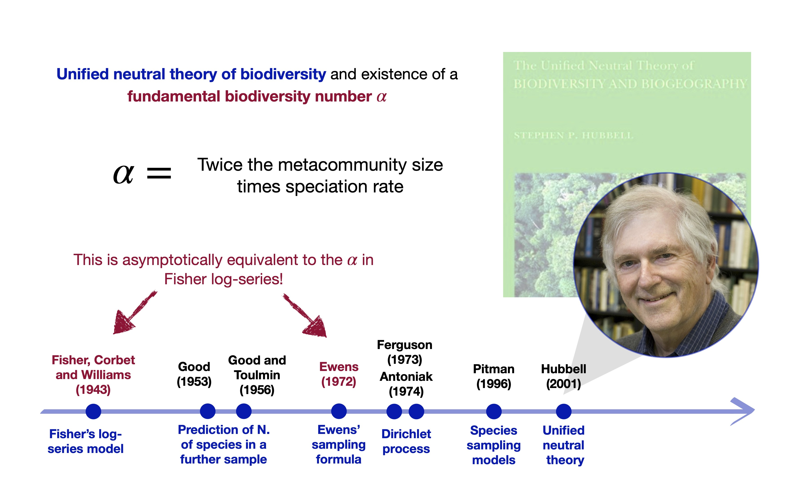

## Short Bio

- My name is [Tommaso Rigon]{.blue} and I am an [Associate Professor]{.orange} of Statistics.

- [University of Milano-Bicocca]{.blue}, Department of Economics, Management and Statistics (DEMS), Milan, Italy.
  - Associate Professor, 2026 - Present
  - Senior Assistant Professor (RTD-B), 2023 - 2026
  - Junior Assistant Professor (RTD-A), 2020 - 2023

- [Duke University]{.blue}, Department of Statistical Science, Durham (NC), U.S.A.
  - Research/Postdoctoral Associate, 2019 - 2020

:::callout-note
#### Education

- [Ph.D. in Statistical Sciences]{.orange}, [Bocconi University](https://www.unibocconi.eu/), Milan, Italy.
- [M.Sc. in Statistical Sciences]{.blue}, [University of Padova](https://www.unipd.it), Padua, Italy.
- [B.Sc. in Statistics, Economics & Finance]{.grey}, [University of Padova](https://www.unipd.it), Padua, Italy.
:::

## The neutral theory of biodiversity [@Hubbell_2001]

{.nostretch fig-align="center" width=85%}

## Names as species

:::callout-tip
#### Background

Under [Hubbell's neutral model]{.orange}, abundances $n_1,\dots,n_K$ of the $K$ distinct types among $n$ individuals follow the [Ewens sampling formula]{.blue} [@ewens72]
$$
p(n_1,\dots,n_K \mid \theta) = \frac{\theta^K}{(\theta)_n}\prod_{j=1}^K (n_j - 1)!, \qquad \theta > 0.
$$
A [single innovation parameter]{.orange} $\theta$ governs diversity: a principled [null hypothesis]{.blue} for apparent trends [@Rigon2026; @Zito2026].
:::

- Types are [species]{.blue} in ecology, and [given names]{.orange} here: US Social Security records, one table per state and year.

- [Catch]{.orange}: names below a privacy threshold are [censored]{.blue}. These rare names carry most of the information about $\theta$, and censoring bites hardest in the smallest states.

## The project

:::callout-tip
#### Plan

1. [State by state]{.blue}: a data-augmentation [Gibbs sampler]{.orange} that imputes the hidden multiplicities of rare names, giving the posterior of $\theta_s$ for each state $s$.

2. [Across states]{.blue}: a [nonparametric mixture prior]{.orange} on $\theta_1,\dots,\theta_{51}$, letting the data decide how many groups there are and which states belong together.

3. [Interpretation]{.blue}: does the partition reflect geography, demography, or something else?
:::

- [Extensions]{.grey}: richer information sharing across states, multiple years.

:::callout-warning
#### Requirements

Good knowledge of [R]{.orange}; some C++ via [Rcpp]{.blue} helps for the sampler. Prior exposure to MCMC for nonparametric mixtures is a plus.
:::

## References
