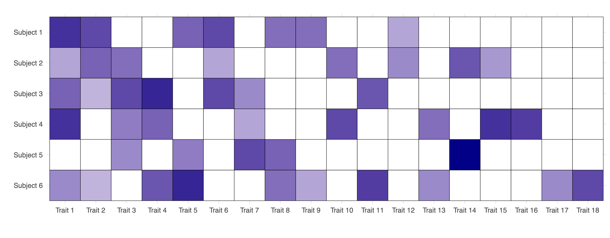
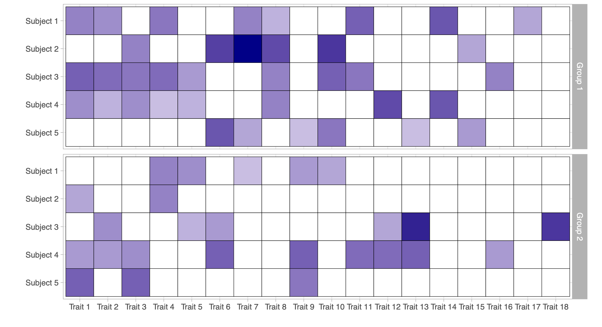
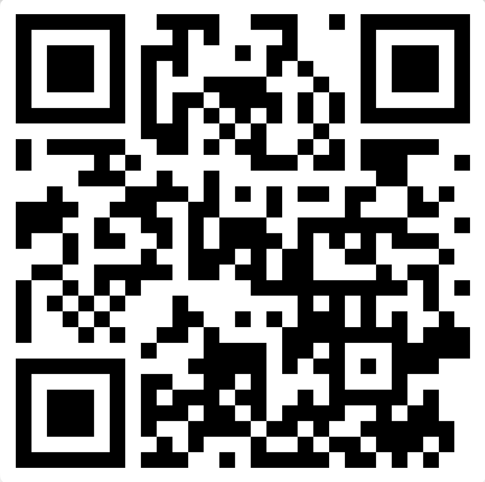

## Warm thanks

::: columns

::: {.column width="30%"}

[Lorenzo Ghilotti]{.orange} (Duke University)

{fig-align="left"}
:::

::: {.column width="3%"}
:::

::: {.column width="30%"}
[Federico Camerlenghi]{.orange} (University of Milano-Bicocca)

{fig-align="left"}

:::

::: {.column width="3%"}
:::

::: {.column width="30%"}
[Michele Guindani]{.orange} (University of California Los Angeles)

{fig-align="left"}

:::

:::

## Overview

- This work proposes a model-based [Bayesian nonparametric]{.orange} approach to [clustering count data]{.blue} in the presence of missing information (i.e., unknown traits), following the roadmap below:

. . .

1. We introduce the main building block: [trait]{.blue} (or feature) [allocation models]{.blue}. Their properties and posterior distributions have been previously studied e.g. in @Ghilotti2025, @beraha25.

. . .

2. We extend these models to the case of [known groups]{.blue}, deriving closed-form expressions for the posterior distribution.

. . .

3. We consider the case of [unknown groups]{.orange} (clustering) by placing a Bayesian nonparametric prior on the latent partition. This is connected to [latent class analysis]{.blue} with missing information.

. . .

4. We illustrate the practical relevance of this methodology through an application to the [criminal network]{.blue} from the *Operazione Infinito* investigation.

## Exchangeable trait allocation models

- Exchangeable trait allocation models [@Jam17; @Camp18] describe how traits are distributed across $n$ subjects, with presence reflecting trait abundance.

. . .

- We observe $n$ subjects and $K_n = k$ traits. The data are represented by an $n \times k$ matrix $\bm{A}$, where 
$$
A_{i\ell} \in \{0,1,2,\ldots\}, \qquad i=1,\dots,n,\quad \ell=1,\dots,k,
$$ 
denotes the [count of trait]{.blue} $\ell$ for subject $i$. We also assign a [label]{.blue}, denoted $X_\ell$, to each trait.

. . .

- The number of traits (columns) is random, because some traits may remain [unseen]{.orange}.

. . .

- Let $(\tilde{X}_j)_{j \geq 1}$ denote the sequence of all possible trait labels and let $\tilde{A}_{ij} \in \{0, 1, 2, \dots\}$ represent the abundance of trait $\tilde{X}_j$ in subject $i$. These are [latent variables]{.orange}. 

- The [observed traits]{.blue} $X_1, \dots, X_{K_n}$ form a subsample of the [latent traits]{.orange} $(\tilde{X}_j)_{j \geq 1}$. A trait $\tilde{X}_j$ is observed only if $\tilde{A}_{ij} > 0$ for at least one subject. 

- Similarly, we say that trait $\ell$ is [absent]{.orange} in subject $i$ if and only if $A_{i\ell} = 0$. Each column of $\bm{A}$ must contain at least one non-zero entry, otherwise the trait would be [unseen]{.orange}.  

## Data from an exchangeable trait model

- Observed data from an [exchangeable trait model]{.blue}: matrix of counts $\bm{A}$, with $n = 6$ subjects and $K_n = 18$ observed traits. White cells indicate the [absence]{.orange} of a trait for a given subject, while darker shades of blue represent higher values of the corresponding counts $A_{i\ell} \in \{1, 2,\dots\}$.

## Model specification

- The [latent traits]{.orange} $\tilde{A}_{ij}$, given a sequence of [parameters]{.blue} $(\theta_j)_{j \geq 1}$, are conditionally iid across subjects for any fixed $j$, that is
$$
\tilde{A}_{ij} \mid \theta_j \overset{\textup{iid}}{\sim} P(\cdot\,; \theta_j), \qquad i \geq 1,
$$
and they are also conditionally independent across traits (columns) for $j \geq 1$. 

- Here, $P(\cdot\,; \theta)$ denotes any [parametric distribution]{.orange} supported on the non-negative integers, such as a Poisson distribution, depending on a positive parameter $\theta > 0$. 

:::{.callout-note}
#### Example: exchangeable binary traits

In our application, we track the attendance of 'Ndrangheta affiliates (subjects) at various meetings (traits), where observed traits correspond to meetings attended by at least one affiliate.

In this case study, the count measurement $\tilde{A}_{ij}$ are binary. Thus, we let 
$$
\tilde{A}_{ij} \mid \theta_j \overset{\textup{iid}}{\sim}  \text{Bernoulli}(\theta_j)
$$ for $i \ge 1$ and any fixed $j$ with success probabilities $\theta_j \in (0, 1)$.   
:::

## Discrete random measure representation

- We organize the pairs $(\tilde{A}_{ij}, \tilde{X}_j)$ for $j \ge 1$ by means of subject-specific [counting measures]{.blue} $(Z_i)_{ i \ge 1}$:
$$
    Z_i(\cdot) = \sum_{j\geq 1} \tilde{A}_{ij} \delta_{\tilde{X}_j}(\cdot),
$$
where $\delta_x$ denotes the Dirac delta mass.

- Moreover, the parameters $(\theta_j)_{j \ge 1}$ can be organized in a [discrete measure]{.orange} $\tilde{\mu}$ defined as
$$
\tilde{\mu}(\cdot) = \sum_{j \geq 1} \theta_j \delta_{\tilde{X}_j}(\cdot).
$$
- Summarizing, the [full Bayesian specification]{.blue} is
$$
\begin{aligned}
Z_i\mid \tilde{\mu} &\overset{\textup{iid}}{\sim} \textup{CP} (\tilde{\mu}), \qquad i \ge 1,\\
\tilde{\mu} &\sim \mathcal{Q},
\end{aligned}
$$
which means that $Z_i$  are iid from a [process of counts]{.blue} (CP) with parameter $\tilde{\mu}$. Here $\mathcal{Q}$ denotes the de Finetti measure, i.e., the [prior distribution]{.orange} of the random measure $\tilde{\mu}$. 

## Partially exchangeable trait allocation models\

- Let $d$ be the number of [subpopulations]{.blue} (groups), and suppose we observe a sample of size $n$, with $n_q$ subjects from group $q$, for $q = 1, \ldots, d$, so that $\sum_{q=1}^d n_q = n$. 

- Let $K_n = k$ denote the total number of traits observed across all subjects and groups. The [data]{.orange} can be represented by a collection of matrices $\bm{A}_q$, each of dimension $n_q \times k$, with entries
$$
A_{i\ell q} \in \{0, 1, 2, \ldots\}, \qquad i = 1,\dots, n, \quad \ell = 1,\dots,k, \quad q=1,\dots,d,
$$ denotes the [count of trait]{.blue} $\ell$ for the $i$th subject in group $q$. 

. . .

- As before, let $(\tilde{X}_j)_{j \geq 1}$ denote the sequence of [latent traits]{.orange} and let $\tilde{A}_{ijq} \in \{0, 1, 2, \dots\}$ be the abundance of trait $\tilde{X}_j$ for subject $i$ in group $q$. 

- In a sample of size $n$, a trait $\tilde{X}_j$ is [observed]{.blue} only if $\tilde{A}_{ijq} > 0$ for at least one subject in any group. 

:::{.callout-note}
#### Example: known-groups binary traits

This known-group structure (partial exchangeability) is well suited to the ‘Ndrangheta data, where affiliates are grouped by membership in specific *locali*.

:::

## Data from a partially exchangeable trait model

{fig-align="center"}

- Observed data from a [partially exchangeable trait model]{.blue} ($d = 2$): two matrices of counts $\bm{A}_1$ and $\bm{A}_2$, each with $n_1 = n_2= 5$ subjects and $K_n = 18$ observed traits. 

## Model specification (known groups)

- The [latent traits]{.orange} $\tilde{A}_{ijq}$, given the sequences of [parameters]{.blue} $(\theta_{j1})_{j \geq 1}, \dots, (\theta_{jd})_{j \geq 1}$, are conditionally iid across subjects belonging to the same group and for a given trait $j$ and group $q$, that is
$$
\tilde{A}_{ijq} \mid \theta_{jq} \overset{\textup{iid}}{\sim} P(\cdot\,; \theta_{jq}), \qquad i \geq 1,
$$
and they are also conditionally independent across traits for $j \geq 1$ and subpopulations $q = 1,\dots,d$. 

- Thus, the main difference compared to the exchangeable case is that the random variables $\tilde{A}_{ijq}$ have [different parameters]{.blue} when they refer to subjects belonging to [different subpopulations]{.orange}. 

. . .

- We organize these quantities into [counting measures]{.blue}  $Z_{iq}(\cdot) = \sum_{j \ge 1} \tilde{A}_{ijq} \, \delta_{\tilde{X}_j}(\cdot)$ for each subject $i$ in subpopulation $q$, with $i \geq 1$ and $q = 1, \ldots, d$. Moreover,  the parameters $(\theta_{jq})_{j \ge 1}$ can be organized in a group-specific discrete measure $\tilde{\mu}_q(\cdot) = \sum_{j \geq 1} \theta_{jq} \delta_{\tilde{X}_j}(\cdot)$ for $q=1,\dots,d$. 

- Summarising, the [full Bayesian specification]{.blue} for partially exchangeable data is
$$
\begin{aligned}
    Z_{iq} \mid \tilde{\mu}_q & \overset{\textup{ind}}{\sim} \textup{CP} (\tilde{\mu}_q), \qquad i\geq 1, \quad q=1,\ldots,d,\\
    (\tilde{\mu}_1,\ldots,\tilde{\mu}_d) &\sim \mathcal{Q}_d,
\end{aligned}
$$
where $\mathcal{Q}_d$ denotes the [prior]{.orange} distribution. 

## Prior specification I

- We assume the [total number of traits]{.orange} in the population, denoted with $N$, is [finite]{.blue} and [random]{.blue}. If $K_n = k$ traits are observed, the number of unseen traits equals $N-k$. 

- Hence, there will be a finite collection of latent traits $\tilde{A}_{i1q}, \dots, \tilde{A}_{iNq}$ for each subject and group, with associated parameters $\theta_{1q},\dots,\theta_{Nq}$ for $q = 1,\dots,d$. 

. . .

- Moreover, we assume $N$ is a Poisson random variable with parameter $\lambda>0$. In other terms, the group-specific measures $\tilde{\mu}_q$ take the form
$$
    \tilde{\mu}_q(\cdot) = \sum_{j=1}^{ N} \theta_{jq} \delta_{\tilde{X}_j}(\cdot), \qquad N \sim \mathrm{Poisson}(\lambda),
$$
as $q=1,\ldots,d$. 

- Moreover, we assume the parameters $\theta_{jq}$ are iid draws from a probability law $H(\cdot\,;\psi)$, namely
$$
\theta_{jq} \overset{\textup{iid}}{\sim} H(\cdot\,;\psi), \qquad j = 1,\dots,N, \quad q=1,\dots,d,
$$
where $\psi$ is a common [hyperparameter]{.blue} sometimes endowed with a hyperprior.

## Prior specification II

- We assign a prior to the atoms $\tilde{X}_j$, which only label traits; it suffices that they are almost surely distinct, e.g., $\tilde{X}_j \overset{\textup{iid}}{\sim} P_0$ with $P_0$ non-atomic.

- This specification is linked with [infinite-dimensional trait]{.orange} models [@Jam17; @shen2025]. 

- Indeed, $(\tilde{\mu}_1,\ldots,\tilde{\mu}_d)$ is a [finite completely random vector]{.blue} (FCRV), a special case of completely random vectors [@Cat21AoS], crucially relying on the Poisson specification for $N$.

- More precisely, $\tilde{\bm{\mu}} = (\tilde{\mu}_1,\ldots,\tilde{\mu}_d)$ can be interpreted as an FCRV with parameters $H^{(d)} =  H(\cdot\,;\psi) \times \cdots \times H(\cdot\,; \psi)$, $\lambda$, and $P_0$, and we write
$$
\tilde{\bm{\mu}} \sim \textup{FCRV}(H^{(d)}, \lambda, P_0).
$$

:::callout-tip
This connection is relevant because as our results follow from a general CRV theory with Lévy intensities of the form $\rho_d(\mathrm{d}\theta_1 \cdots \mathrm{d}\theta_d)\,\lambda P_0(\mathrm{d}x)$, where $\rho_d$ may be infinite.

This framework covers both finite- and infinite-dimensional models; we focus on the finite case $\rho_d = H^{(d)}$ (a probability distribution), enabling estimation of the total number of traits, while @shen2025 consider the infinite-dimensional setting.
:::

# Distribution theory

## The augmented likelihood function

<!-- We start by describing the marginal distribution of a sample from model \eqref{eq:partially_ex_traits}, and here we offer a simple and constructive proof. With \emph{marginal distribution of the sample}  $\bm{Z}=(Z_{iq}:  i= 1,\ldots,n_q; q=1,\ldots,d)$, we specifically mean determining the probabilities of the event $(\bm{A} = \bm{a}, K_n = k)$, having denoted by -->
<!-- $\bm A = (A_{i \ell q} : i=1,\dots, n_q; \ell = 1,\dots,k; q = 1,\dots,d)$ the observed counts, where the $K_n=k$ observed traits in the sample are randomly ordered.  -->

- If all traits were known ([no missing information]{.orange}), the model would be [extremely simple]{.orange}: a collection of independent random variables, with an easily computable [augmented likelihood]{.blue}.

- Let $\tilde{\bm{A}} = (\tilde{A}_{ijq} : i = 1, \dots, n_q; j = 1, \dots, N; q = 1, \dots , d)$ denote the latent counts whose realization is $\tilde{\bm{a}}$ and let $\mathcal{A} = \{j : \sum_{q=1}^d \sum_{i=1}^{n_q} \tilde{a}_{ijq} > 0\}$ denote the observed traits.

. . .

- The [augmented likelihood]{.blue} function $\mathscr{L}(\bm{\theta}, N; \tilde{\bm{a}})$ given the parameters $\bm{\theta} = (\theta_{jq} : j=1,\dots,N; q = 1,\dots,d)$ and $N$, for the event $(\tilde{\bm{A}} = \tilde{\bm{a}}, K_n = k)$ is
$$
\mathscr{L}(\bm{\theta}, N; \tilde{\bm{a}})= \prod_{q=1}^d  \prod_{j=1}^N\prod_{i=1}^{n_q}P(\tilde{a}_{ijq};\theta_{j q})= \left[\prod_{q=1}^d\prod_{j \not\in \mathcal{A}} P(0;\theta_{j q})^{n_q}\right]\left[ \prod_{q=1}^d \prod_{j\in \mathcal{A}}\prod_{i=1}^{n_q}P(\tilde{a}_{ijq};\theta_{j q})\right].
$$
In the last term, the first product accounts for [unobserved]{.orange} traits, while the second corresponds to [observed]{.blue} ones.

- The product $\prod_{q=1}^d P(0; \theta_{jq})^{n_q}$ is the probability that trait $\tilde{X}_j$ is not observed in any subject across all groups.

## Marginal distribution

:::callout-warning
#### Theorem (Marginal distribution; @Ghilotti2025b)

Let $\bm{Z}$ be a sample from the partially exchangeable model, with $\tilde{\bm{\mu}} \sim \textup{FCRV}(H^{(d)}, \lambda, P_0)$ with $H^{(d)}(\cdot\,;\psi) = H(\cdot\,;\psi) \times \cdots \times H(\cdot\,; \psi)$. 

The probability that $\bm{Z}$ displays $K_n = k$ distinct traits with counts $\bm A = \bm{a}$ is given by
$$
\begin{split}
        \pi_n (\bm{a}; \lambda, \psi) = \frac{\lambda^k}{k!} \exp \left\{ -\lambda \left( 1-\prod_{q=1}^d  \int P (0 ; \theta)^{n_q}
        H (\mathrm{d}\theta; \psi) \right) \right\} \prod_{\ell=1}^k \prod_{q=1}^d  \int  \prod_{i=1}^{n_q} P (a_{i\ell q} ; \theta)  H(\mathrm{d} \theta; \psi),
\end{split}
$$
where $n=\sum_{q=1}^d n_q$ and $\bm{n}=(n_1, \ldots , n_d)$ are the sample sizes.

:::

## Example: binary traits I

- Suppose the traits are [binary]{.orange} and $P(a;\theta) = \theta^a(1-\theta)^{1-a}$, for $a \in \{0, 1\}$, meaning that
$$
\tilde{A}_{ijq} \overset{\textup{ind}}{\sim} \text{Bernoulli}(\theta_{jq}), \qquad i \ge 1, \quad j=1,\dots,N, \quad q = 1,\dots,q.
$$

- The marginal law of $\bm{Z}$ depends on the sufficient statistic given by the [feature frequencies]{.blue}, where $M_{\ell q} := \sum_{i=1}^{n_q} A_{i\ell q}$ (with observed values $m_{\ell q}$) are collected in matrices $\bm{M}$ and $\bm{m}$.

- Suppose the prior $H(\cdot;\psi)$ is a [Beta distribution]{.blue} with parameters $\psi = (-\alpha, \alpha+\beta)$, i.e.,
$$
\theta_{jq} \overset{\textup{iid}}{\sim} \text{Beta}(-\alpha, \alpha + \beta), \qquad j=1,\dots,N, \quad q=1,\dots,d.
$$
- Then, the probability that $\bm{Z}$ displays $K_n = k$ distinct traits with feature frequencies $\bm M = \bm{m}$ is
$$
        \begin{split}
        \pi_n (\bm{m}; \lambda, \psi) = \frac{\lambda^k}{k!} \exp \left\{ -\lambda \left[1- \prod_{q=1}^d \frac{(\alpha + \beta)_{n_q}}{(\beta)_{n_q}}  \right]\right\} \prod_{\ell=1}^k \prod_{q=1}^d  \frac{-\alpha}{(\beta)_{n_q}}(1-\alpha)_{m_{\ell q}-1}(\alpha + \beta)_{n_q - m_{\ell q}},
        \end{split}
$$
where $(a)_n = a(a+1)\cdots(a+n-1)$ is the ascending factorial with $a > 0$. 

## Posterior distribution

:::callout-warning
#### Theorem (Posterior distribution; @Ghilotti2025b)

Let $\bm{Z}$ be a sample from the partially exchangeable model with prior $\tilde{\bm{\mu}} \sim \textup{FCRV}(H^{(d)}, \lambda, P_0)$ and $H^{(d)}(\cdot\,;\psi) = H(\cdot\,;\psi) \times \cdots \times H(\cdot\,; \psi)$. 

If $\bm{Z}$ displays $K_n = k$ distinct traits labeled $X_1, \ldots , X_k$, with associated counts $\bm{a}$, then the [posterior distribution]{.blue} of $\tilde{\bm\mu}$ satisfies the distributional equality
$$       
(\tilde{\mu}_1, \ldots, \tilde{\mu}_d) \mid \bm{Z} \stackrel{d}{=}  (\mu_1^*, \ldots, \mu_d^*) +  (\mu_1', \ldots, \mu_d'),
$$
where $\bm{\mu}^*:= (\mu_1^*, \ldots, \mu_d^*)$ and $\bm{ \mu}':=(\mu_1', \ldots, \mu_d')$ are independent random vectors such that

i. the components of the vector $\bm{\mu}^*$ are defined as $\mu_q^*(\cdot) = \sum_{\ell=1}^k \theta_{\ell q}^* \delta_{X_\ell}(\cdot)$, for $q=1, \ldots , d$, and the random variables $\theta^*_{\ell q}$ are independent with distribution  $H_{\ell q} (\mathrm{d}\theta;\psi) \propto  \prod_{i = 1}^{n_q} P(a_{i\ell q}; \theta)  H(\mathrm{d}\theta; \psi)$.

ii. the vector $(\mu_1', \ldots, \mu_d')$ is a $\textup{FCRV} (H^{\prime(d)}, \lambda',  P_0)$, where $H^{\prime(d)}(\cdot\,;\psi) = H_1^\prime(\cdot\,;\psi) \times \cdots \times H_d^\prime(\cdot\,;\psi)$,
           $$
           \lambda' = \lambda \prod_{q=1}^d \int P(0; \theta)^{n_q} H(\mathrm{d}\theta; \psi),
           \quad 
           H'_q(\mathrm{d}\theta; \psi)  \propto  P(0;  \theta)^{n_q} H(\mathrm{d}\theta;\psi). 
           $$
:::

## Example: binary traits II

# Clustering trait allocation models

## Latent class models with an unknown number of traits

# *Infinito* network

## Thank you!

{width=2.5in fig-align="center"}

The [main paper]{.orange} is: 

Ghilotti, L., Rigon, T.,  Camerlenghi F., and Guindani M. (2025). Bayesian nonparametric modeling of multivariate count data with an unknown number of traits. *arXiv:2510.24526*

## References {.unnumbered .smaller}

::: {#refs}
:::

