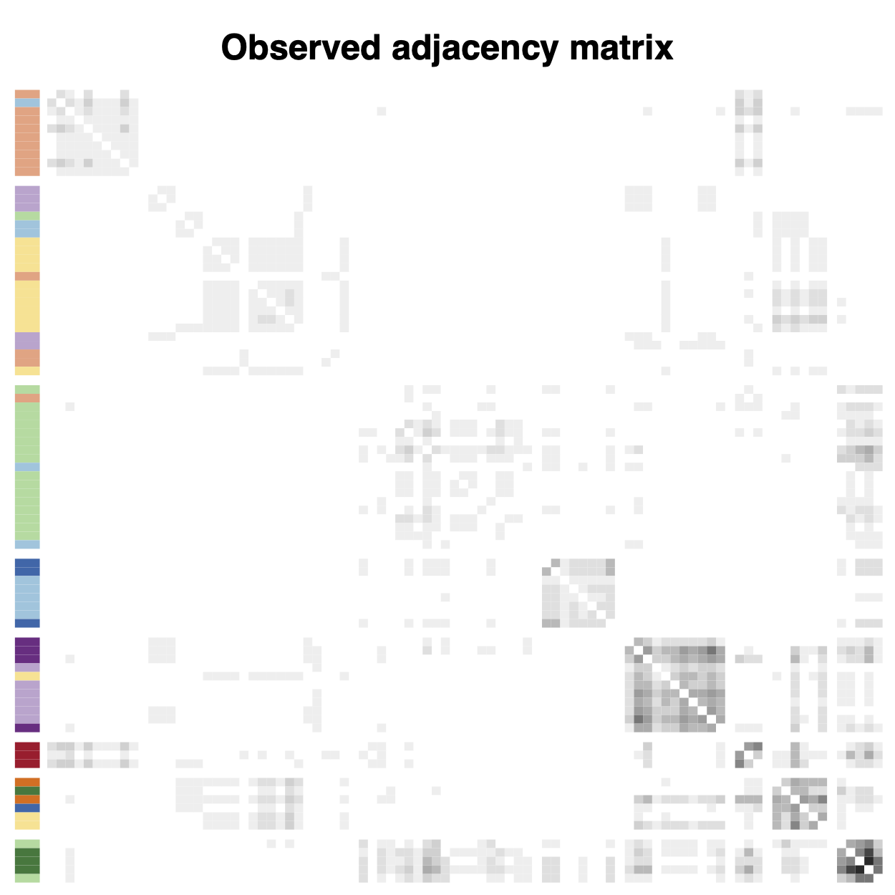
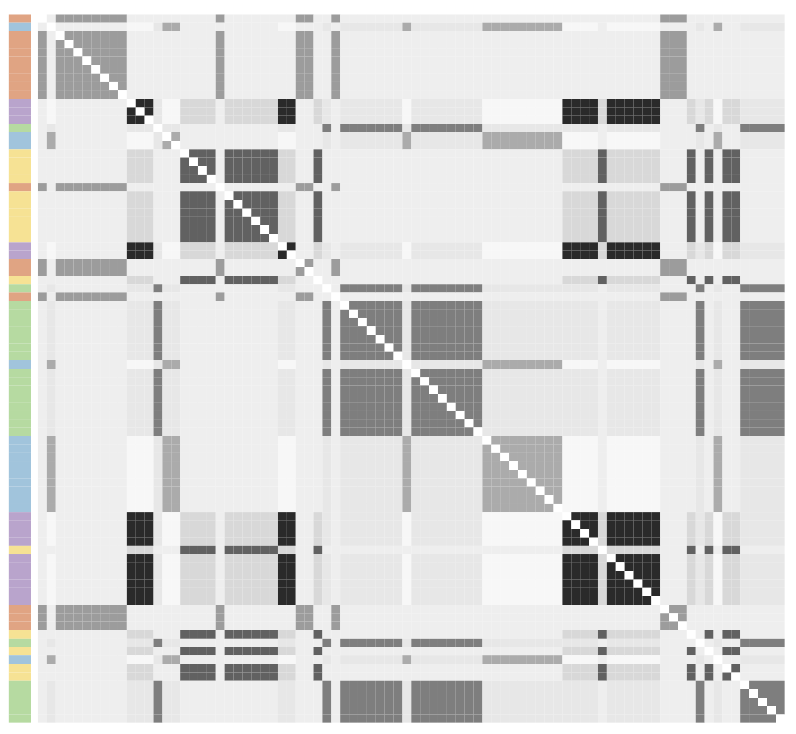
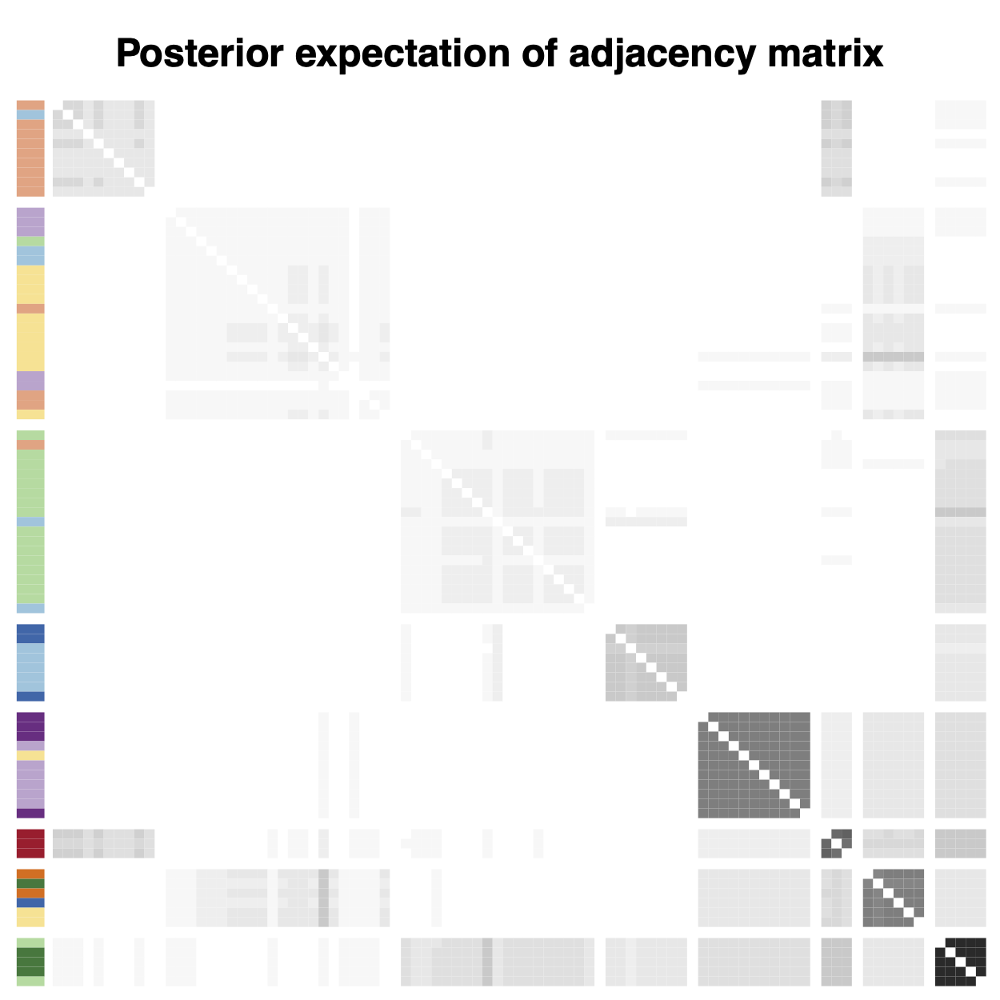
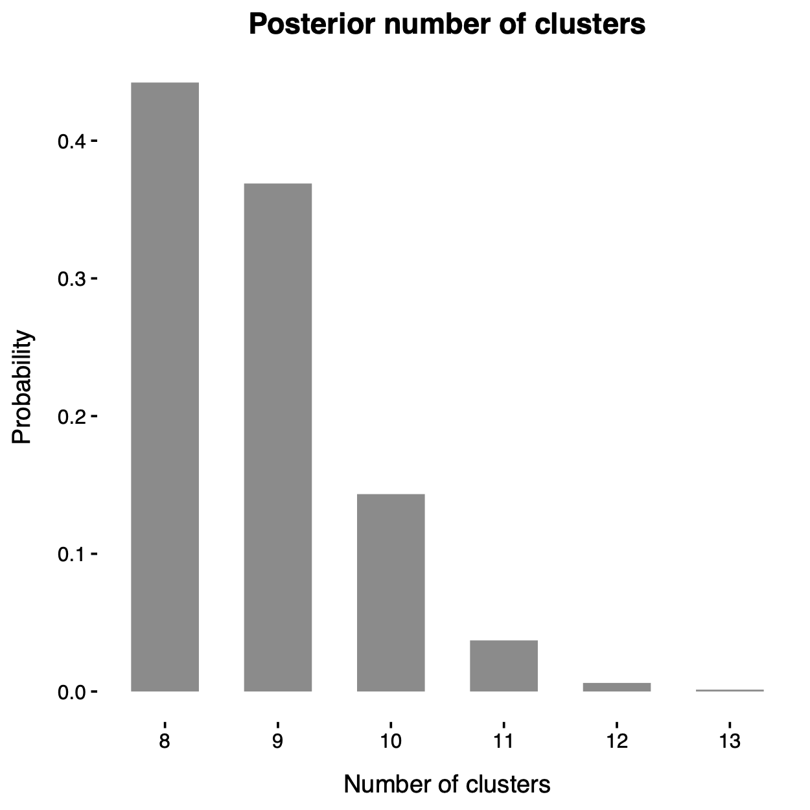
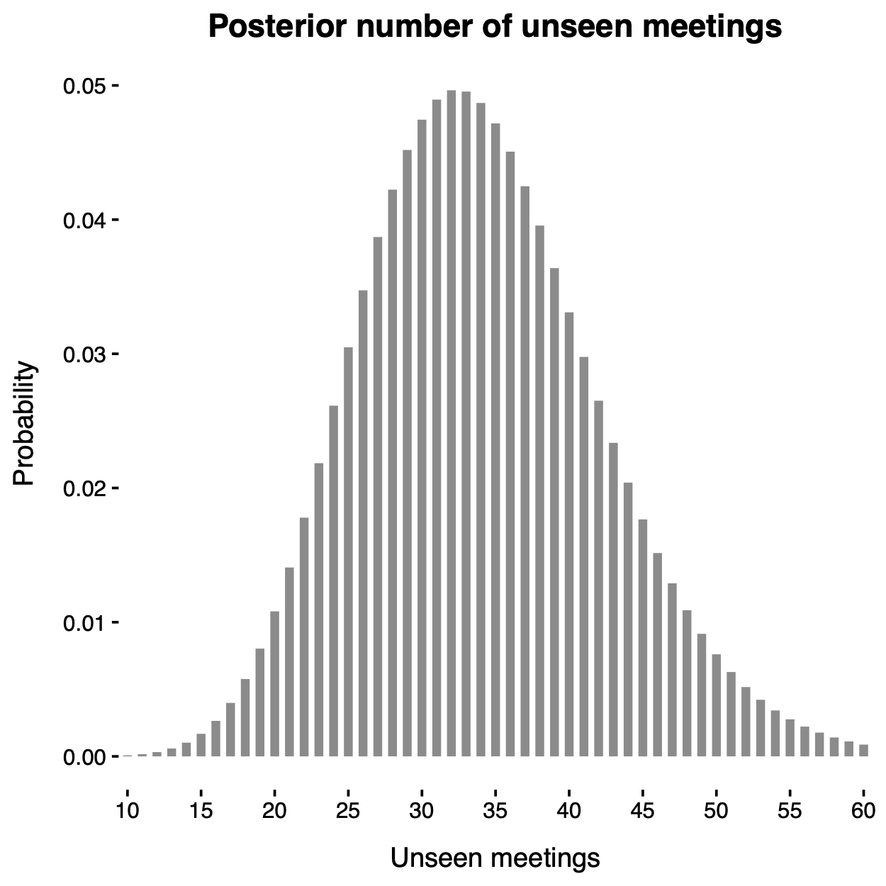
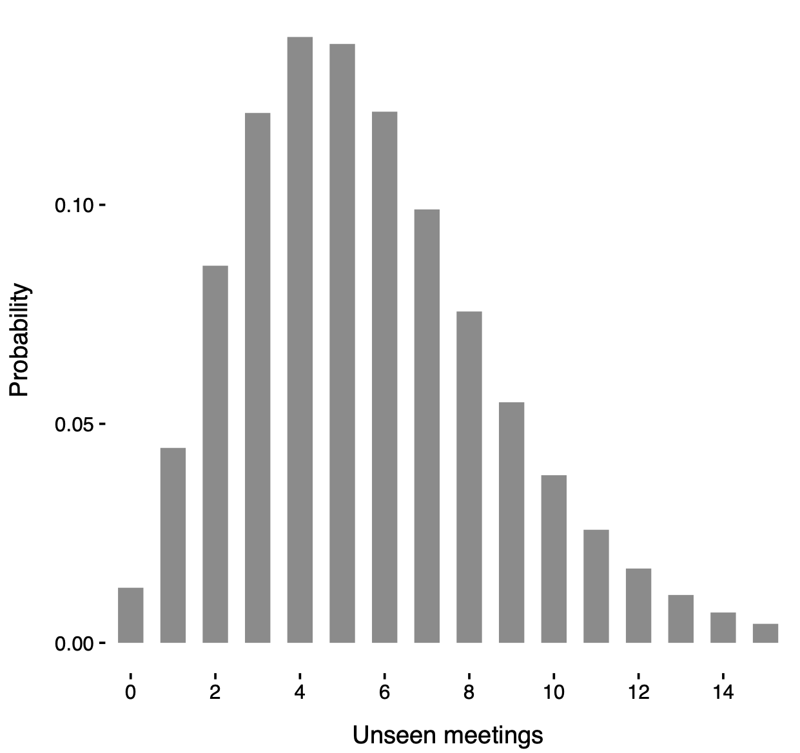

## Warm thanks

::: columns

::: {.column width="30%"}

[Lorenzo Ghilotti]{.orange} (Duke University)

{fig-align="left"}
:::

::: {.column width="3%"}
:::

::: {.column width="30%"}
[Federico Camerlenghi]{.orange} (University of Milano-Bicocca)

{fig-align="left"}

:::

::: {.column width="3%"}
:::

::: {.column width="30%"}
[Michele Guindani]{.orange} (University of California Los Angeles)

{fig-align="left"}

:::

:::

## Overview

- This work proposes a model-based [Bayesian nonparametric]{.orange} approach to [clustering count data]{.blue} in the presence of missing information (i.e., unknown traits), following the roadmap below:

. . .

1. We introduce the main building block: [trait]{.blue} (or feature) [allocation models]{.blue}. Their properties have been previously studied e.g. in @Ghilotti2025, @beraha25.

. . .

2. We extend these models to the case of [known groups]{.blue}, deriving closed-form expressions for the posterior distribution.

. . .

3. We consider the case of [unknown groups]{.orange} (clustering) by placing a Bayesian nonparametric prior on the latent partition. This is connected to [latent class analysis]{.blue} with missing information.

. . .

4. We illustrate the practical relevance of this methodology through an application to the [criminal network]{.blue} from the *Operazione Infinito* investigation.

# Trait allocation models

## Exchangeable trait allocation models

- Exchangeable trait allocation models [@Jam17; @Camp18] describe how traits are distributed across $n$ subjects, with presence reflecting trait abundance.

. . .

- We observe $n$ subjects and $K_n = k$ traits. The data are represented by an $n \times k$ matrix $\bm{A}$, where 
$$
A_{i\ell} \in \{0,1,2,\ldots\}, \qquad i=1,\dots,n,\quad \ell=1,\dots,k,
$$ 
denotes the [count of trait]{.blue} $\ell$ for subject $i$. We also assign a [label]{.blue}, denoted $X_\ell$, to each trait.

. . .

- The number of traits (columns) is random, because some traits may remain [unseen]{.orange}.

. . .

- Let $(\tilde{X}_j)_{j \geq 1}$ denote the sequence of all possible trait labels and let $\tilde{A}_{ij} \in \{0, 1, 2, \dots\}$ represent the abundance of trait $\tilde{X}_j$ in subject $i$. These are [latent variables]{.orange}. 

- The [observed traits]{.blue} $X_1, \dots, X_{K_n}$ form a subsample of the [latent traits]{.orange} $(\tilde{X}_j)_{j \geq 1}$. A trait $\tilde{X}_j$ is observed only if $\tilde{A}_{ij} > 0$ for at least one subject. 

- Similarly, we say that trait $\ell$ is [absent]{.orange} in subject $i$ if and only if $A_{i\ell} = 0$. Each column of $\bm{A}$ must contain at least one non-zero entry, otherwise the trait would be [unseen]{.orange}.  

## Data from an exchangeable trait model

- Observed data from an [exchangeable trait model]{.blue}: matrix of counts $\bm{A}$, with $n = 6$ subjects and $K_n = 18$ observed traits. White cells indicate the [absence]{.orange} of a trait for a given subject, while darker shades of blue represent higher values of the corresponding counts $A_{i\ell} \in \{1, 2,\dots\}$.

## Model specification

- The [latent traits]{.orange} $\tilde{A}_{ij}$, given a sequence of [parameters]{.blue} $(\theta_j)_{j \geq 1}$, are conditionally iid across subjects for any fixed $j$, that is
$$
\tilde{A}_{ij} \mid \theta_j \overset{\textup{iid}}{\sim} P(\cdot\,; \theta_j), \qquad i \geq 1,
$$
and they are also conditionally independent across traits (columns) for $j \geq 1$. 

- Here, $P(\cdot\,; \theta)$ denotes any [parametric distribution]{.orange} supported on the non-negative integers, such as a Poisson distribution, depending on a positive parameter $\theta > 0$. 

:::{.callout-note}
#### Example: exchangeable binary traits

In our application, we track the attendance of 'Ndrangheta affiliates (subjects) at various meetings (traits), where observed traits correspond to meetings attended by at least one affiliate.

In this case study, the count measurement $\tilde{A}_{ij}$ are binary. Thus, we let 
$$
\tilde{A}_{ij} \mid \theta_j \overset{\textup{iid}}{\sim}  \text{Bernoulli}(\theta_j)
$$ for $i \ge 1$ and any fixed $j$ with success probabilities $\theta_j \in (0, 1)$.   
:::

## Discrete random measure representation

- We organize the pairs $(\tilde{A}_{ij}, \tilde{X}_j)$ for $j \ge 1$ by means of subject-specific [counting measures]{.blue} $(Z_i)_{ i \ge 1}$:
$$
    Z_i(\cdot) = \sum_{j\geq 1} \tilde{A}_{ij} \delta_{\tilde{X}_j}(\cdot),
$$
where $\delta_x$ denotes the Dirac delta mass.

- Moreover, the parameters $(\theta_j)_{j \ge 1}$ can be organized in a [discrete measure]{.orange} $\tilde{\mu}$ defined as
$$
\tilde{\mu}(\cdot) = \sum_{j \geq 1} \theta_j \delta_{\tilde{X}_j}(\cdot).
$$
- Summarizing, the [full Bayesian specification]{.blue} is
$$
\begin{aligned}
Z_i\mid \tilde{\mu} &\overset{\textup{iid}}{\sim} \textup{CP} (\tilde{\mu}), \qquad i \ge 1,\\
\tilde{\mu} &\sim \mathcal{Q},
\end{aligned}
$$
which means that $Z_i$  are iid from a [process of counts]{.blue} (CP) with parameter $\tilde{\mu}$. Here $\mathcal{Q}$ denotes the de Finetti measure, i.e., the [prior distribution]{.orange} of the random measure $\tilde{\mu}$. 

## Partially exchangeable trait allocation models

- Let $d$ be the number of [subpopulations]{.blue} (groups), and suppose we observe a sample of size $n$, with $n_q$ subjects from group $q$, for $q = 1, \ldots, d$, so that $\sum_{q=1}^d n_q = n$. 

- Let $K_n = k$ denote the total number of traits observed across all subjects and groups. The [data]{.orange} can be represented by a collection of matrices $\bm{A}_q$, each of dimension $n_q \times k$, with entries
$$
A_{i\ell q} \in \{0, 1, 2, \ldots\}, \qquad i = 1,\dots, n, \quad \ell = 1,\dots,k, \quad q=1,\dots,d,
$$ denotes the [count of trait]{.blue} $\ell$ for the $i$th subject in group $q$. 

. . .

- As before, let $(\tilde{X}_j)_{j \geq 1}$ denote the sequence of [latent traits]{.orange} and let $\tilde{A}_{ijq} \in \{0, 1, 2, \dots\}$ be the abundance of trait $\tilde{X}_j$ for subject $i$ in group $q$. 

- In a sample of size $n$, a trait $\tilde{X}_j$ is [observed]{.blue} only if $\tilde{A}_{ijq} > 0$ for at least one subject in any group. 

:::{.callout-note}
#### Example: known-groups binary traits

This known-group structure (partial exchangeability) is well suited to the ‘Ndrangheta data, where affiliates are grouped by membership in specific *locali*.

:::

## Data from a partially exchangeable trait model

{fig-align="center"}

- Observed data from a [partially exchangeable trait model]{.blue} ($d = 2$): two matrices of counts $\bm{A}_1$ and $\bm{A}_2$, each with $n_1 = n_2= 5$ subjects and $K_n = 18$ observed traits. 

## Model specification (known groups)

- The [latent traits]{.orange} $\tilde{A}_{ijq}$, given the sequences of [parameters]{.blue} $(\theta_{j1})_{j \geq 1}, \dots, (\theta_{jd})_{j \geq 1}$, are conditionally iid across subjects belonging to the same group and for a given trait $j$ and group $q$, that is
$$
\tilde{A}_{ijq} \mid \theta_{jq} \overset{\textup{iid}}{\sim} P(\cdot\,; \theta_{jq}), \qquad i \geq 1,
$$
and they are also conditionally independent across traits for $j \geq 1$ and subpopulations $q = 1,\dots,d$. 

- Thus, the main difference compared to the exchangeable case is that the random variables $\tilde{A}_{ijq}$ have [different parameters]{.blue} when they refer to subjects belonging to [different subpopulations]{.orange}. 

. . .

- As before, we organize these quantities into [counting measures]{.blue}  $Z_{iq}(\cdot) = \sum_{j \ge 1} \tilde{A}_{ijq} \, \delta_{\tilde{X}_j}(\cdot)$ for each subject $i$ in subpopulation $q$, with $i \geq 1$ and $q = 1, \ldots, d$. Moreover,  the parameters $(\theta_{jq})_{j \ge 1}$ can be organized in a group-specific discrete measure $\tilde{\mu}_q(\cdot) = \sum_{j \geq 1} \theta_{jq} \delta_{\tilde{X}_j}(\cdot)$ for $q=1,\dots,d$. 

- The [full Bayesian specification]{.blue} for partially exchangeable data (known groups) is
$$
\begin{aligned}
    Z_{iq} \mid \tilde{\mu}_q & \overset{\textup{ind}}{\sim} \textup{CP} (\tilde{\mu}_q), \qquad i\geq 1, \quad q=1,\ldots,d,\\
    (\tilde{\mu}_1,\ldots,\tilde{\mu}_d) &\sim \mathcal{Q}_d,
\end{aligned}
$$
where $\mathcal{Q}_d$ denotes the [prior]{.orange} distribution. 

## Prior specification I

- We assume the [total number of traits]{.orange} in the population, denoted with $N$, is [finite]{.blue} and [random]{.blue}. If $K_n = k$ traits are observed, the number of unseen traits equals $N-k$. 

- Hence, there will be a finite collection of latent traits $\tilde{A}_{i1q}, \dots, \tilde{A}_{iNq}$ for each subject and group, with associated parameters $\theta_{1q},\dots,\theta_{Nq}$ for $q = 1,\dots,d$. 

. . .

- Moreover, we assume $N$ is a Poisson random variable with parameter $\lambda>0$. In other terms, the group-specific measures $\tilde{\mu}_q$ take the form
$$
    \tilde{\mu}_q(\cdot) = \sum_{j=1}^{ N} \theta_{jq} \delta_{\tilde{X}_j}(\cdot), \qquad N \sim \mathrm{Poisson}(\lambda),
$$
as $q=1,\ldots,d$. 

- Moreover, we assume the parameters $\theta_{jq}$ are iid draws from a probability law $H(\cdot\,;\psi)$, namely
$$
\theta_{jq} \overset{\textup{iid}}{\sim} H(\cdot\,;\psi), \qquad j = 1,\dots,N, \quad q=1,\dots,d,
$$
where $\psi$ is a common [hyperparameter]{.blue} sometimes endowed with a hyperprior.

## Prior specification II

- We assign a prior to the atoms $\tilde{X}_j$, which only label traits; it suffices that they are almost surely distinct, e.g., $\tilde{X}_j \overset{\textup{iid}}{\sim} P_0$ with $P_0$ non-atomic.

- This specification is linked with [infinite-dimensional trait]{.orange} models [@Jam17; @shen2025]. 

- Indeed, $(\tilde{\mu}_1,\ldots,\tilde{\mu}_d)$ is a [finite completely random vector]{.blue} (FCRV), a special case of completely random vectors [@Cat21AoS], crucially relying on the Poisson specification for $N$.

- More precisely, $\tilde{\bm{\mu}} = (\tilde{\mu}_1,\ldots,\tilde{\mu}_d)$ can be interpreted as an FCRV with parameters $H^{(d)} =  H(\cdot\,;\psi) \times \cdots \times H(\cdot\,; \psi)$, $\lambda$, and $P_0$, and we write
$$
\tilde{\bm{\mu}} \sim \textup{FCRV}(H^{(d)}, \lambda, P_0).
$$

:::callout-tip
This connection is relevant because as our results follow from a general CRV theory with Lévy intensities of the form $\rho_d(\mathrm{d}\theta_1 \cdots \mathrm{d}\theta_d)\,\lambda P_0(\mathrm{d}x)$, where $\rho_d$ may be infinite.

This framework covers both finite- and infinite-dimensional models; we focus on the finite case $\rho_d = H^{(d)}$ (a probability distribution), enabling estimation of the total number of traits, while @shen2025 consider the infinite-dimensional setting.
:::

# Distribution theory

## The augmented likelihood function

<!-- We start by describing the marginal distribution of a sample from model \eqref{eq:partially_ex_traits}, and here we offer a simple and constructive proof. With \emph{marginal distribution of the sample}  $\bm{Z}=(Z_{iq}:  i= 1,\ldots,n_q; q=1,\ldots,d)$, we specifically mean determining the probabilities of the event $(\bm{A} = \bm{a}, K_n = k)$, having denoted by -->
<!-- $\bm A = (A_{i \ell q} : i=1,\dots, n_q; \ell = 1,\dots,k; q = 1,\dots,d)$ the observed counts, where the $K_n=k$ observed traits in the sample are randomly ordered.  -->

- If all traits were known ([no missing information]{.orange}), the model would be [extremely simple]{.orange}: a collection of independent random variables, with an easily computable [augmented likelihood]{.blue}.

- Let $\tilde{\bm{A}} = (\tilde{A}_{ijq} : i = 1, \dots, n_q; j = 1, \dots, N; q = 1, \dots , d)$ denote the latent counts whose realization is $\tilde{\bm{a}}$ and let $\mathcal{A} = \{j : \sum_{q=1}^d \sum_{i=1}^{n_q} \tilde{a}_{ijq} > 0\}$ denote the indices of observed traits.

. . .

- The [augmented likelihood]{.blue} function $\mathscr{L}(\bm{\theta}, N; \tilde{\bm{a}})$ given the parameters $\bm{\theta} = (\theta_{jq} : j=1,\dots,N; q = 1,\dots,d)$ and $N$, for the event $(\tilde{\bm{A}} = \tilde{\bm{a}}, K_n = k)$ is
$$
\mathscr{L}(\bm{\theta}, N; \tilde{\bm{a}})= \prod_{q=1}^d  \prod_{j=1}^N\prod_{i=1}^{n_q}P(\tilde{a}_{ijq};\theta_{j q})= \left[\prod_{q=1}^d\prod_{j \not\in \mathcal{A}} P(0;\theta_{j q})^{n_q}\right]\left[ \prod_{q=1}^d \prod_{j\in \mathcal{A}}\prod_{i=1}^{n_q}P(\tilde{a}_{ijq};\theta_{j q})\right].
$$
In the last term, the first product accounts for [unobserved]{.orange} traits, while the second corresponds to [observed]{.blue} ones.

<!-- - [Remark]{.orange}. The product $\prod_{q=1}^d P(0; \theta_{jq})^{n_q}$ is the probability that trait $\tilde{X}_j$ is not observed in any subject across all groups. -->

- [Remark]{.orange}. Combining the augmented likelihood with the iid priors $H(\mathrm{d}\theta;\psi)$, integrating over $\bm{\theta}$ and $N \sim \text{Poisson}(\lambda)$, and summing over all $\mathcal{A}$, we obtain the [marginal]{.blue} probability of $(\bm{A} = \bm{a}, K_n = k)$.

## Marginal distribution

:::callout-warning
#### Theorem (Marginal distribution; @Ghilotti2025b)

Let $\bm{Z}$ be a sample from the partially exchangeable model, with $\tilde{\bm{\mu}} \sim \textup{FCRV}(H^{(d)}, \lambda, P_0)$ and $H^{(d)}(\cdot\,;\psi) = H(\cdot\,;\psi) \times \cdots \times H(\cdot\,; \psi)$. 

The probability that $\bm{Z}$ displays $K_n = k$ distinct traits with counts $\bm A = \bm{a}$ is given by
$$
\begin{split}
        \pi_n (\bm{a}; \lambda, \psi) = \frac{\lambda^k}{k!} \exp \left\{ -\lambda \left( 1-\prod_{q=1}^d  \int P (0 ; \theta)^{n_q}
        H (\mathrm{d}\theta; \psi) \right) \right\} \prod_{\ell=1}^k \prod_{q=1}^d  \int  \prod_{i=1}^{n_q} P (a_{i\ell q} ; \theta)  H(\mathrm{d} \theta; \psi),
\end{split}
$$
where $n=\sum_{q=1}^d n_q$ and $\bm{n}=(n_1, \ldots , n_d)$ are the sample sizes.

:::

- The quantity $\pi_n (\bm{a}; \lambda, \psi)$ is the [marginal likelihood]{.blue} of $(\lambda, \psi)$ based on the observed data.

- Informally, it can be regarded as the "[normalizing constant]{.orange}" of the posterior of $\tilde{\bm{\mu}}$. 

- This is related to the partially Exchangeable Partition Probability Function (pEPPF) discussed in @franzolini2025 for partially exchangeable species sampling models. 

## Example: binary traits I

- Suppose the traits are [binary]{.orange} and $P(a;\theta) = \theta^a(1-\theta)^{1-a}$, for $a \in \{0, 1\}$, meaning that
$$
\tilde{A}_{ijq} \overset{\textup{ind}}{\sim} \text{Bernoulli}(\theta_{jq}), \qquad i \ge 1, \quad j=1,\dots,N, \quad q = 1,\dots,q.
$$

- The marginal law of $\bm{Z}$ depends on the sufficient statistic given by the [feature frequencies]{.blue}, where $M_{\ell q} := \sum_{i=1}^{n_q} A_{i\ell q}$ (with observed values $m_{\ell q}$) are collected in matrices $\bm{M}$ and $\bm{m}$.

. . .

- Suppose the prior $H(\cdot;\psi)$ is a [Beta distribution]{.blue} with parameters $\psi = (-\alpha, \alpha+\beta)$, i.e.,
$$
\theta_{jq} \overset{\textup{iid}}{\sim} \text{Beta}(-\alpha, \alpha + \beta), \qquad j=1,\dots,N, \quad q=1,\dots,d.
$$

. . .

- Then, the [marginal probability]{.blue} that $\bm{Z}$ displays $K_n = k$ distinct traits with feature frequencies $\bm M = \bm{m}$ is
$$
        \begin{split}
        \pi_n (\bm{m}; \lambda, \psi) = \frac{\lambda^k}{k!} \exp \left\{ -\lambda \left[1- \prod_{q=1}^d \frac{(\alpha + \beta)_{n_q}}{(\beta)_{n_q}}  \right]\right\} \prod_{\ell=1}^k \prod_{q=1}^d  \frac{-\alpha}{(\beta)_{n_q}}(1-\alpha)_{m_{\ell q}-1}(\alpha + \beta)_{n_q - m_{\ell q}},
        \end{split}
$$
where $(a)_n = a(a+1)\cdots(a+n-1)$ is the ascending factorial with $a > 0$. 

## Posterior distribution

:::callout-warning
#### Theorem (Posterior distribution; @Ghilotti2025b)

Let $\bm{Z}$ be a sample from the partially exchangeable model with prior $\tilde{\bm{\mu}} \sim \textup{FCRV}(H^{(d)}, \lambda, P_0)$ and $H^{(d)}(\cdot\,;\psi) = H(\cdot\,;\psi) \times \cdots \times H(\cdot\,; \psi)$. 

If $\bm{Z}$ displays $K_n = k$ distinct traits labeled $X_1, \ldots , X_k$, with associated counts $\bm{a}$, then the [posterior distribution]{.blue} of $\tilde{\bm\mu}$ satisfies the distributional equality
$$       
(\tilde{\mu}_1, \ldots, \tilde{\mu}_d) \mid \bm{Z} \stackrel{d}{=}  (\mu_1^*, \ldots, \mu_d^*) +  (\mu_1', \ldots, \mu_d'),
$$
where $\bm{\mu}^*:= (\mu_1^*, \ldots, \mu_d^*)$ and $\bm{ \mu}':=(\mu_1', \ldots, \mu_d')$ are independent random vectors such that

i. the components of the vector $\bm{\mu}^*$ are defined as $\mu_q^*(\cdot) = \sum_{\ell=1}^k \theta_{\ell q}^* \delta_{X_\ell}(\cdot)$, for $q=1, \ldots , d$, and the random variables $\theta^*_{\ell q}$ are independent with distribution  $H_{\ell q} (\mathrm{d}\theta;\psi) \propto  \prod_{i = 1}^{n_q} P(a_{i\ell q}; \theta)  H(\mathrm{d}\theta; \psi)$.

ii. the vector $(\mu_1', \ldots, \mu_d')$ is a $\textup{FCRV} (H^{\prime(d)}, \lambda',  P_0)$, where $H^{\prime(d)}(\cdot\,;\psi) = H_1^\prime(\cdot\,;\psi) \times \cdots \times H_d^\prime(\cdot\,;\psi)$,
           $$
           \lambda' = \lambda \prod_{q=1}^d \int P(0; \theta)^{n_q} H(\mathrm{d}\theta; \psi),
           \quad 
           H'_q(\mathrm{d}\theta; \psi)  \propto  P(0;  \theta)^{n_q} H(\mathrm{d}\theta;\psi). 
           $$
:::

## Example: binary traits II

- Suppose the traits are [binary]{.orange} and assuming a beta prior law $H(\cdot;\psi)$ with parameters $(-\alpha, \alpha + \beta)$.

- The posterior distribution of $\tilde{\bm{\mu}}$ given $\bm{Z}$ decomposes as the sum of $\bm{\mu}^*$ and $\bm{\mu}'$, as in the general case. 

  i. The probabilities $\theta^*_{\ell q}$ of re-observing an old feature $X_\ell$ are distributed as 
  $$
  \theta^*_{\ell q} \overset{\textup{ind}}{\sim} \text{Beta}(m_{\ell q} - \alpha, \alpha + \beta + n_q - m_{\ell q}),
  $$ 
  for $\ell=1,\dots,k$, $q=1,\dots,d$.
  ii. Each $\mu_q^\prime =  \sum_{j=1}^{N^\prime} \theta_{j q}^\prime \delta_{\tilde{X}_j^\prime}(\cdot)$, which governs unobserved traits in subpopulation $q$, have a tractable form. In particular, the distribution of the number of [unseen features]{.orange} $N^\prime = N - k$ is
$$
N^\prime \sim \text{Poisson}(\lambda^\prime), \qquad \lambda^\prime =  \lambda \prod_{q=1}^d \frac{(\alpha + \beta)_{n_q}}{(\beta)_{n_q}},
$$
whereas the probabilities of observing these traits are distributed as $\theta_{jq}^\prime \overset{\textup{iid}}{\sim} \text{Beta}(-\alpha, \alpha + \beta + n_q)$.

<!-- ## Hyperprior elicitation -->

<!-- - When prior information on the hyperparameters $\psi$ and $\lambda$ is lacking, a common Bayesian approach is to introduce a [hyperprior]{.blue}. -->

<!-- - In the binary case, the posterior of $\psi = (\alpha, \beta)$ has [no closed form]{.blue}, so one must rely on [Markov Chain Monte Carlo]{.orange} sampling (MCMC). -->

<!-- - A closed-form, tractable expression for the [marginal likelihood]{.blue} $\pi_n (\bm{m}; \lambda, \psi)$ is crucial, as it enables practical Metropolis–Hastings updates. -->

<!-- . . . -->

<!-- - On the other hand, assume $\lambda \sim \text{Gamma}(\alpha_\lambda, \beta_\lambda)$, which induces a [negative binomial]{.blue} distribution for $N$. This hyperprior is [conjugate]{.orange} to the model: -->
<!-- $$ -->
<!-- \lambda \mid \bm{Z} \sim \text{Gamma}\left(\alpha_\lambda + k, \beta_\lambda + 1 - \prod_{q=1}^d \int P(0; \theta)^{n_q} H(\mathrm{d}\theta; \psi)\right). -->
<!-- $$ -->

# Clustering trait allocation models

## From known-groups to unknown groups

- The partially exchangeable framework accommodates group-structured data by assuming homogeneity within [predefined subpopulations]{.orange}.

- In practice, however, either no grouping is known or the given partition may be inadequate. In such cases, one can instead [learn the group structure]{.blue} from the data.
  
:::callout-note
In the 'Ndrangheta application, affiliates can be grouped by their membership in *locali*.

However, it is worth assessing whether this external partition reflects the structure of meeting attendance. Discrepancies between inferred clusters and *locali* may reveal unrecognized collaborations or new cross-group dynamics.
:::

- We consider an unknown-groups setting by embedding the partially exchangeable model in a [Bayesian clustering]{.blue} framework, enabling cluster detection while accounting for unseen traits.

- Our goal is to [infer a partition]{.orange} of the subjects $Z_1, \ldots, Z_n$, rather than relying on predefined groups.

## Model specification (unknown groups)

- Let $\bm{C} = {C_1,\dots,C_d}$ be a [partition]{.orange} of $\{1,\dots,n\}$, where $i,i’ \in C_q$ iff subjects $i$ and $i’$ belong to the same group.

- Let $n_q = |C_q|$ be the size of cluster $q$, with $\sum_{q=1}^d n_q = n$. If $\bm{C}$ is known, we recover the known-groups setting. 

. . . 

- When $\bm{C}$ is [unknown]{.orange}, we place a prior on it, so both the [cluster memberships]{.blue} and the [number of groups]{.orange} $d$ are [random]{.blue} and learned from the data.

- Conditionally on $\bm{C} = {C_1,\dots,C_d}$, for a fixed trait $j$ and group $q$, we assume, as in the known-groups case, that
$$
\tilde{A}_{ij} \mid \theta_{jq} \overset{\textup{iid}}{\sim} P(\cdot; \theta_{jq}),\qquad i \in C_q.
$$
Moreover, as in the known-group case, we let
$$
N \sim \text{Poisson}(\lambda), \qquad \theta_{jq} \overset{\textup{iid}}{\sim} H(\cdot\,;\psi), \qquad j = 1,\dots,N, \quad q=1,\dots,d,
$$

## Random partitions

- Among the various prior for $\bm{C}$, we consider the prior induced by a [Pitman–Yor process]{.blue} [@Per92; @Pit97], which stands for its analytical tractability and whose density is
$$
\mathbb{P}(\bm{C} = \{C_1,\dots,C_d\}) =\frac{\prod_{q=1}^{d-1}(\gamma + q\sigma)}{(\gamma + 1)_{n-1}}\prod_{q=1}^d(1 - \sigma)_{n_q-1},
$$
where $\gamma > -\sigma$, $\sigma \in [0, 1)$. 

- Note that the [number of groups]{.blue} $1 \le d \le n$ is itself a [random variable]{.orange} and there is no upper bound other than the sample size.

- The above expression is referred to as [exchangeable partition probability function]{.blue} @Pitman1996. 

- When $\sigma = 0$, the Pitman–Yor process reduces to a [Dirichlet process]{.orange} [@Ferguson1973]. 

. . .

- For a general characterization of exchangeable [Gibbs-type random partitions]{.blue}, including the Pitman–Yor as a special case, see @DeBlasi2015. 

- Recent developments on random partitions with finitely many clusters are discussed in @Lijoi2020, @Lijoi2024, @Colombi2025. 

## Hierarchical representation and mixture models

- We can equivalently express this model in a [hierarchical]{.orange} form
$$
\begin{aligned}
        Z_i \mid \mu_i & \overset{\textup{ind}}{\sim} \textup{CP}(\mu_i), \qquad \mu_i \mid \tilde{p} \overset{\textup{iid}}{\sim}  \tilde{p}, \qquad i \ge 1,\\
         \tilde{p} &\sim \mathcal{P},
\end{aligned}
$$
where $\tilde{p}$ is a [discrete random probability measure]{.blue}, and $\mathcal{P}$ denotes its prior distribution. More precisely, we assume that
$$
    \tilde{p}(\cdot) = \sum_{h \geq 1} \xi_h \delta_{\eta_h}(\cdot),
$$
where $(\xi_h)_{h \geq 1}$ are probability weights, and $(\eta_h)_{h \geq 1}$ are random measures $\eta_h = \sum_{j=1}^N\phi_{jh}\delta_{\tilde{X}_j}$. 

- The weights $\xi_h$ represent prior clustering probabilities, with $\xi_h$ giving the probability that $\mu_i$ is drawn from the $h$th component of $\tilde{p}$, i.e., $\mu_i = \eta_h$. 

- They follow the [stick-breaking]{.orange} representation of the Pitman–Yor process: $\xi_h = V_h \prod_{r=1}^{h-1}(1 - V_r)$, where $V_h \sim \text{Beta}(1 - \sigma, \gamma + h\sigma)$ and $\xi_1 = V_1$.

- We assume that any $d$-dimensional subset of $(\eta_h)_{h \geq 1}$ follows $(\tilde{\eta}_1,\ldots,\tilde{\eta}_d) \sim \textup{FCRV}(H^{(d)}, \lambda, P_0)$. 

## Hierarchical representation and mixture models

- [Remark]{.orange}. The discreteness of $\tilde{p}$ implies that there is a positive probability that $\mu_i$ and $\mu_{i'}$ are be identical, inducing [clustering]{.blue} among the observations $Z_1,\dots,Z_n$. 

- By employing an exchangeable prior for $\bm{C}$, we are implicitly returning to an exchangeable framework
$$
\begin{aligned}
        Z_i \mid \tilde{p} &\overset{\textup{iid}}{\sim} \int \textup{CP} (\mu)\tilde{p} (\mathrm{d} \mu) \\ % \textup{CPM} (\tilde{p}), \qquad i \ge 1,\\
         \tilde{p} &\sim \mathcal{P},
\end{aligned}
$$
where the subjects $Z_i$ are conditionally iid draws from a process of counts [mixture]{.blue}. 

- This model is far [more flexible]{.orange} than the known-group, where $Z_i \mid \tilde{\mu} \overset{\textup{iid}}{\sim} \textup{CP}(\tilde{\mu})$. Indeed, we have that $Z_i(\cdot) = \sum_{j=1}^N \tilde{A}_{ij}\delta_{\tilde{X}_j}(\cdot)$ and
$$
\mathbb{P}(\tilde{A}_{i1} = \tilde{a}_1,\dots,\tilde{A}_{iN} = \tilde{a}_N\mid \tilde{p}) = \sum_{h \ge 1} \xi_h \prod_{j=1}^NP(\tilde{a}_j; \phi_{jh}), \qquad i \ge 1,
$$
where the random vectors $(\tilde{A}_{i1},\dots, \tilde{A}_{iN})$ for $i \ge 1$ are conditionally iid from the above law. 

- The proposed Bayesian model defined is related to [latent class analysis]{.blue} (LCA). 

## Ignoring the unseen traits

- However, LCA assume that $N$ is a known constant, meaning that all traits are known in advance, including those equal to zero for all subjects. [Ignoring unseen traits]{.orange} can [skew]{.orange} the analysis.

- Consider the following [predictive allocation probabilities]{.blue}:
$$
p_{iq} = \mathbb{P}(\mu_i = \tilde{\mu}_q \mid \bm{Z}, \bm{\mu}_{-i}), \qquad p_{i,\text{new}} = \mathbb{P}(\mu_i = \text{``new''} \mid \bm{Z}, \bm{\mu}_{-i}), \qquad i=1,\dots,n,
$$
where $\bm{\mu}_{-i} = (\mu_1,\dots\mu_{i-1},\mu_{i+1},\dots,\mu_n)$ with $d_{-i}$ distinct values $\tilde{\mu}_1,\dots,\tilde{\mu}_{d_{-i}}$, for $q = 1,\dots,d_{-i}$. 

- We similarly define $p_{iq}^*$ and $p_{i,\text{new}}^*$ for the naïve model in which it is wrongly assumed that all traits are observed with $N = k$. 

:::callout-warning
#### Proposition [@Ghilotti2025b]

The predictive allocation probabilities for a generic subject $i$ under the proposed and a naïve model in which it is assumed that there are no unseen traits, with $N = k$, satisfy the inequality:
$$
 \frac{p_{i,\textup{new}}}{p_{iq}} <  \frac{p_{i,\textup{new}}^*}{p_{iq}^*}, \qquad q=1,\dots,d_{-i}, \quad i=1,\dots,n.
$$
:::

## Markov Chain Monte Carlo algorithm

- Posterior inference for the partition $\bm{C}$ rely on a simple [Gibbs sampling]{.blue} algorithm. 

. . .

- We [iteratively sample]{.blue} the labels of $\mu_i \mid \bm Z, \bm{\mu}_{-i}$ for $i=1,\dots,n$ according to the [full conditional probabilities]{.orange} $p_{iq}$ and $p_{i,\text{new}}$, which are proportional to
$$
p_{iq} \propto \frac{n_{q,-i} - \sigma}{n + \gamma - 1}\,\pi_n(\bm{a}_{iq}; \lambda, \psi), \qquad p_{i,\textup{new}} \propto \frac{\gamma + d_{-i}\sigma}{n+\gamma-1}\,\pi_n(\bm{a}_{i,\textup{new}}; \lambda, \psi),
$$
where $\bm{a}_{iq}$ denotes the observed trait values organized according to the partition $\bm{C}_{-i}$, with subject $i$ allocated to cluster $q$. Similarly, $\bm{a}_{i,\textup{new}}$ corresponds to the trait values organized according to the partition $\bm{C}_{-i}$ when subject $i$ is assigned to a new cluster. 

. . .

- This  scheme is straightforward thanks to the closed-form expression of $\pi_n(\bm a; \lambda, \psi)$.

- When hyperpriors are placed on the parameters $\lambda$ and $\psi$, the MCMC scheme described above is coupled with updates of $\lambda$ and $\psi$ from their respective [full conditional]{.blue} distributions. 

. . .

- Any other quantity of interest, such as $N$ or $\theta_{jq}$, can be easily sampled as a [post-processing step]{.orange} exploiting the posterior representation.

# *Infinito* network

## *Operazione Infinito* dataset

- The data stem from *Operazione Infinito* [@Calderoni17], a six-year-long, large-scale [law enforcement operation]{.blue} aimed at monitoring and dismantling the core structure of *La Lombardia*, the highly pervasive branch of the 'Ndrangheta Mafia operating in the Milan area.  

. . .
 
- The attendance of the $n$ affiliates at $k$ distinct [meetings]{.blue} can be represented by the $n \times k$ binary matrix $\bm{A}$, where each entry $A_{i\ell} \in \{0, 1\}$ indicates whether [individual]{.blue} $i$ [attended meeting]{.orange} $\ell$. 

- We are also interested in understanding the implications on the [adjacency matrix]{.blue} 
$$
\bm{W} = \bm{A}\bm{A}^T,
$$
whose generic entry $W_{ii'}$ represents the number of [meetings jointly attended]{.blue} by affiliates $i$ and $i'$.

. . .

- We focus on the $d = 5$ [most populated *locali*]{.orange}, with sizes $n_1 = 16,n_2 = 14, n_3 = 23, n_4 = 15, n_5 = 16$, of the *Infinito* dataset, for a total of $n = 84$ affiliates and $k = 44$ recorded meetings among them. 

- Affiliates’ *locale* membership defines a natural five-group partition, which we compare with the groups inferred from the mixture model.

## Adjacency matrix of the *Infinito* network

{width=80% fig-align="center"}

- [Observed adjacency matrix]{.blue}, partitioned according to the VI clustering [@Wad18].  Side colors correspond to the *locali*, with darker/lighter shades denoting bosses/affiliates.

## Hyperparameter settings and practicalities

- We consider models for [binary traits]{.orange}, where $H(\cdot;\psi)$ is the beta distribution with parameters $(-\alpha, \alpha + \beta)$, with $\psi = (\alpha, \beta)$. 

- Prior distributions for the model hyperparameters $\lambda$, $-\alpha$, and $\alpha + \beta$ are specified as follows:
  i. The parameter $\lambda$, governing the Poisson-distributed total number of meetings, is assigned a gamma prior with parameters $(\alpha_\lambda, \beta_\lambda)$. 
  ii. The hyperparameters $(\alpha_\lambda, \beta_\lambda)$ are chosen so that the prior expected value of $N$ equals $\hat{N} = 1.5k$, where $k = 44$ denotes the observed number of meetings in the dataset, and the prior variance of $N$ is set to $10\hat{N}$. 
  iii. For the parameters $(a, b) = (-\alpha, \alpha + \beta)$ of the beta distribution $H$, independent gamma priors are assumed with hyperparameters $(\alpha_a, \beta_a)$ and $(\alpha_b, \beta_b)$, respectively. Specifically, $(\alpha_a, \beta_a)$ are set to induce a prior mean of $0.2$ for $a$ with a large variance, while $(\alpha_b, \beta_b)$ are chosen so that the prior mean of $b$ is $10$, also with high variance. 

- In the [mixture model]{.blue}, we additionally set $\sigma = 0$, corresponding to a Dirichlet process, and $\gamma = 1$. 

- For both models, posterior inference relies on $10,000$ MCMC iterations, with the first 1,000 samples discarded as [burn-in]{.orange} and a thinning interval of $2$.

## Estimated posterior probabilities of co-occurrence

::: columns

::: {.column width="45%"}

{fig-align="center"}
Posterior expectation under a [known-groups]{.blue} specification with partition induced by *locali* membership.
:::

::: {.column width="10%"}
:::

::: {.column width="45%"}

{fig-align="center"}

Posterior expectation under an [unknown-groups]{.orange} model with groups $\bm{C}$ learned from the data.
:::
:::

## Posterior number of clusters

{width=70% fig-align="center"}

- Posterior distribution of the number of clusters $d$ in the [mixture model]{.blue}. 

- In particular, such a distribution is strictly greater than $5$ (i.e. the number of *locali*), consolidating the idea that *locali* do not fully capture the network structure. 

## Posterior distribution of the unseen meetings

::: columns

::: {.column width="45%"}

{fig-align="center"}
Posterior distribution of $N'$ under a [known-groups]{.blue} specification with partition induced by *locali* membership.
:::

::: {.column width="10%"}
:::

::: {.column width="45%"}

{fig-align="center"}

Posterior distribution of $N'$  under an [unknown-groups]{.orange} model with groups $\bm{C}$ learned from the data.
:::
:::

## Final considerations

- Consistent with @esbm_rigon and @Lu2025, the inferred group structure reveals intricate organizational dynamics (more in the [paper]{.orange}!).

- Notably, there is a clear tendency for clusters to form within individual *locali*, though the mechanisms governing group formation vary between affiliates and bosses. 

- This suggests a design aimed at [resilience]{.orange}: lower-ranked affiliates can form peripheral groups more easily, whereas core groups (including all bosses) are more constrained and typically smaller.

. . .

- Our unknown-groups model also suggests the likely presence of a few number of [undetected meetings]{.blue}, which aligns with expectations and confirms the need of accounting for unseen traits.

- Nevertheless, some [caution]{.orange} is warranted. Estimating the number of unseen meetings is an extrapolation task, making accuracy hard to assess. Simulation studies support the model under correct specification, but [some misspecification]{.orange} is inevitable in practice. 

- Thus, estimates should be viewed as rough indications, and interpreted conservatively.

## Thank you!

{width=2.5in fig-align="center"}

The [main paper]{.orange} is: 

Ghilotti, L., Rigon, T.,  Camerlenghi F., and Guindani M. (2025). Bayesian nonparametric modeling of multivariate count data with an unknown number of traits. *arXiv:2510.24526*

## References {.unnumbered .smaller}

::: {#refs}
:::

