## Warm thanks (statistical team)

::: columns

::: {.column width="30%"}
{fig-align="left"}

[Ching-Lung Hsu]{.blue} 

(*Duke University*)
:::

::: {.column width="5%"}
:::

::: {.column width="30%"}

{fig-align="left"}

[Alessandro Zito]{.blue} 

(*Harvard School of Public Health*)

:::

::: {.column width="5%"}
:::

::: {.column width="30%"}
{fig-align="left"}

[David Dunson]{.blue} 

(*Duke University*)
:::

:::


## Warm thanks (ecological team, and more...)

::: columns

::: {.column width="30%"}
{fig-align="left"}

[Otso Ovaskainen]{.blue} 

(*University of Jyväskylä*)
:::

::: {.column width="5%"}
:::

::: {.column width="30%"}

{fig-align="left"}

[Tomas Roslin]{.blue} 

(*University of Helsinki*)

:::

::: {.column width="5%"}
:::

::: {.column width="30%"}
{fig-align="left"}

[International BARCODE OF LIFE]{.blue} 

:::

:::

- ...and Niittynen, P., Hebert, P. D. N., Zakharov, E., Ratnasingham, S., and the entire [iBOL Consortium]{.orange}!,

## Species sampling models

- Let $X_1,\dots,X_n$ be some collection of [species]{.blue} or [taxa]{.orange}. Suppose $X_n$ are conditionally iid samples from a [species sampling model]{.orange}:
$$
  (X_n \mid \tilde{p}) \overset{\text{iid}}{\sim} \tilde{p}, \qquad 
  \tilde{p}(\cdot) = \sum_{h=1}^{\infty}\pi_h \delta_{Z_h}(\cdot), 
  \qquad n \ge 1,
$$
where $(\pi_h)_{h \ge 1}$ is a set of probabilities ([species proportions]{.blue}) and $Z_h$ represent distinct species. 

- The discreteness of $\tilde{p}$ identifies $Y^{(n)}=y$ distinct taxa  $X_1^*, \ldots, X_y^*$ with frequencies $n_1, \ldots, n_y$, called [abundances]{.orange} in ecology.

- [Gibbs-type priors]{.blue} have emerged as the [most natural extension]{.orange} of the DP [@DeBlasi2015].

- The [predictive distribution]{.blue} of a Gibbs-type prior is given by: $$
  \mathbb{P}(X_{n+1} \in \cdot \mid X_1,\dots,X_n) 
   = \frac{V_{n+1, y+1}}{V_{n,y}}P(\cdot) 
   + \frac{V_{n+1, y}}{V_{n,y}}\sum_{j=1}^y(n_j - \sigma)\delta_{X^*_j}(\cdot).
$$
where $(a)_{n}$ denotes a rising factorial, and $\sigma < 1$ is the discount parameter.  The $V_{n,y}$'s are non-negative weights satisfying a forward recursive equation.


## Three notable examples

- [Dirichlet multinomial]{.orange} ($\sigma < 0$). For $\sigma < 0$ and $H \in \mathbb{N}$, a valid set of Gibbs coefficients is given by:
$$
V_{n, y}(\sigma, H) := \frac{|\sigma|^{y-1}\prod_{j=1}^{y-1}(H - j)}{(H|\sigma| +1)_{n-1}} 
\mathbb{I}(y \le H).
$$

- [Dirichlet process]{.blue} ($\sigma = 0$). For $\sigma = 0$ and $\alpha > 0$, a valid set of Gibbs coefficients is given by: $$
V_{n, y}(\alpha) := \frac{\alpha^y}{(\alpha)_n}.
$$

- [$\sigma$-stable Poisson–Kingman process]{.grey} ($0 < \sigma < 1$). For $\sigma \in (0,1)$ and gamma $\gamma > 0$, a valid set of Gibbs coefficients is defined as: $$
V_{n, y}(\sigma, \gamma) := \frac{\sigma^y\gamma^y}{\Gamma(n-y\sigma)f_{\sigma}\left(\gamma^{-1/\sigma}\right)}
\int_{0}^{1}s^{n-1-y\sigma}f_{\sigma}\left(\left(1-s\right)\gamma^{-1/\sigma}\right)\, \mathrm{d}s,
$$
where $f_\sigma(t) = (\pi)^{-1} \sum_{h=1}^\infty (-1)^{h+1}\sin(h \pi \sigma )\Gamma(h\sigma + 1) / t^{h\sigma + 1}.$


## A characterization theorem

:::callout-warning
#### Theorem [@Gnedin2005]

The Gibbs coefficients $V_{n, y}$ satisfy the recursive equation in the following three cases:

- If $\sigma < 0$, whenever $V_{n, y} = \sum_{h=1}^\infty V_{n, y}(\sigma, h) p(h)$, for some discrete random variable $H \in \mathbb{N}$ with pdf $p(h)$, where the $V_{n, y}(\sigma, h)$'s are those of the [Dirichlet multinomial]{.orange}.

- If $\sigma = 0$, whenever $V_{n, y} = \int_{\mathbb{R}^+} V_{n, y}(\alpha) p(\mathrm{d}\alpha)$, for some positive random variable $\alpha$ with probability measure $p(\mathrm{d}\alpha)$, where the $V_{n, y}(\alpha)$'s are those of the [Dirichlet process]{.blue}.

- If $\sigma \in (0,1)$, whenever $V_{n, y} = \int_{\mathbb{R}^+} V_{n, y}(\sigma, \gamma) p(\mathrm{d}\gamma),$ 
for some positive random variable $\gamma$ with probability measure $p(\mathrm{d}\gamma)$, where the $V_{n, y}(\sigma, \gamma)$'s are those of the [$\sigma$-stable PK]{.grey}.

:::


- The [Dirichlet multinomial]{.orange}, [Dirichlet process]{.blue}, and [$\sigma$-stable PK]{.grey} form the foundation of any Gibbs-type prior.  

- In fact, any Gibbs-type process can be represented [hierarchically]{.blue}, involving a suitable [prior distribution]{.orange} for the key parameters $H$, $\alpha$, and $\gamma$.

## The quantification of biodiversity [@Lijoi2007]

- The simplest measure of biodiversity is arguably the taxon [richness]{.orange} $Y^{(n)} = y$.

- A priori, the distribution of $Y^{(n)}$ induced by a Gibbs-type prior has a simple form:
$$
\mathbb{P}(Y^{(n)} = y)=V_{n,y}\frac{\mathscr{C}(n,y;\sigma)}{\sigma^y},
$$
where $\mathscr{C}(n, y;\sigma)$ denotes a generalized factorial coefficient. 

- The a priori expectations $\mathbb{E}(K_1),\dots,\mathbb{E}(K_n)$ define a model-based [rarefaction]{.blue} curve.

- The [posterior distribution]{.blue} of the number of previously unobserved taxa $Y_m^{(n)}$ is
$$
\mathbb{P}(Y_m^{(n)}= j \mid X_1,\dots,X_n)=\frac{V_{n + m, y + j}}{V_{n, y}}\frac{\mathscr{C}(m, j;\sigma, -n + y\sigma)}{\sigma^j}, \qquad j=0,\dots,m,
$$
where $\mathscr{C}(m, j;\sigma, -n + y\sigma)$ is the noncentral generalized factorial coefficient.

- The posterior expectations $\mathbb{E}(Y^{(n+1)} \mid Y^{(n)} = y), \dots, \mathbb{E}(Y^{(n + m)} \mid Y^{(n)} = y)$ represents a model-based [extrapolation]{.orange} of the accumulation curve.

## Rarefaction and extrapolation

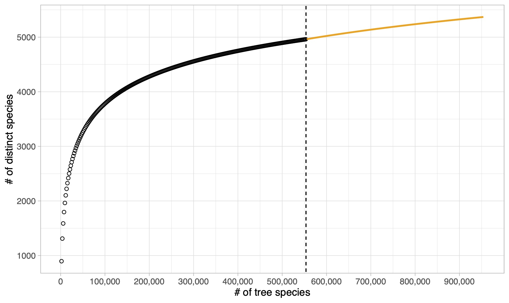{.nostretch fig-align="center" width=85%}

## The $\sigma$-diversity [@Pitman2003]

- Let $Y^{(n)}$ be the number of distinct values arising from a Gibbs-type prior:
  i. Let $\sigma < 0$ and $V_{n, y}(\sigma, H)$ be the weights of a [Dirichlet multinomial]{.orange}, then $Y^{(n)} \rightarrow H$ a.s.
  ii. Let $\sigma = 0$ and $V_{n, y}(\alpha)$ be the weights of a [Dirichlet process]{.blue}, then $Y^{(n)} / \log(n) \rightarrow \alpha$ a.s.
  iii. Let $\sigma \in (0,1)$ and $V_{n, y}(\sigma, \gamma)$ be the weights of a [$\sigma$-stable PK]{.grey}, then $Y^{(n)} / n^\sigma \rightarrow \gamma$ a.s.

- Moreover, consider a generic set of weights $V_{n, y}$ and let $$
c_\sigma(n) = 
\begin{cases} 
1, & \sigma <0,\\[2mm]
\log(n), & \sigma = 0,\\[1mm]
n^{\sigma}, & \sigma \in (0,1)
\end{cases}
$$
Then, as $n \rightarrow \infty$:
$$
\frac{Y^{(n)}}{c_\sigma(n)} \overset{\textup{a.s.}}{\longrightarrow} S_{\sigma}.
$$
The r.v. $S_{\sigma}$ is the [$\sigma$-diversity]{.blue} and its distribution coincides with the prior for $H$, $\alpha$, and $\gamma$.


## Specimens and BINs in Barcode of Life

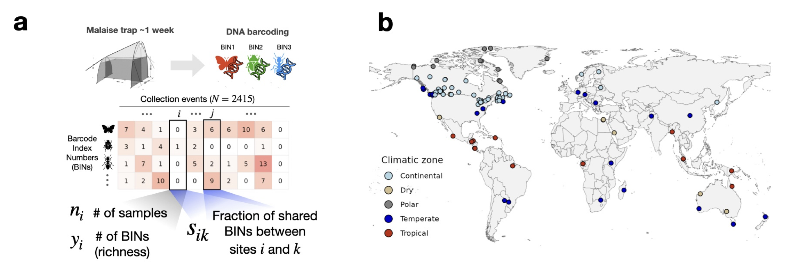{.nostretch fig-align="center" width=100%}

- Our data: global Malaise Trap project.

- We have a total of $1,781,340$ [arthropods]{.orange} split across $154,688$ BINs and  $N = 2415$ [sampling sites]{.blue}.


## How can we link covariates with biodiversity? 

- For outcome $Y_i$ and covariates $\bm{x}_i = (x_{i1}, \ldots, x_{ip}) \in \mathbb{R}^p$, $i = 1, \ldots, N$, a generalized linear model ([GLM]{.blue}) extends the linear model in non-Gaussian settings via three ingredients:

- The [exponential dispersion family]{.blue} directing each $Y_i$:
$$
f(y_i; \theta_i, \phi) = \exp\left\{\frac{y_i \theta_i - b(\theta_i)}{a_i(\phi)} + c(y_i, \phi)\right\},
$$
where $\theta_i \in \Theta$ is the [natural parameter]{.blue}, $\phi > 0$ is the [dispersion]{.orange}, and $a_i,b,c$ are given functions.

- The [linear predictor]{.orange} $\eta_i = \bm{x}_i^\top \bm{\beta}$, with $\bm{\beta} \in \mathbb{R}^p$.

- A monotonic [link function]{.grey} $g$ that links $\eta_i$ with the mean of $Y_i$, namely $\mu(\theta_i) = \mu_i$:
$$
\mathbb{E}(Y_i \mid \bm{x}_i) = \mu_i = g^{-1}(\eta_i).
$$
The link is [canonical]{.orange} when $g$ is such that $\theta_i = \eta_i$.

- Is there an exponential family that is related to a sample-specific diversity $\alpha_i$?


## The Hubbell regression

- The number of distinct species from a DP is [an exponential family!]{.blue}
$$
\mathbb{P}(Y^{(n)} = y; \alpha) = \frac{\alpha^y}{(\alpha)_n}|s(n, y)|, \qquad y \in\{ 1, \ldots, n\},
$$
where $(\alpha)_n = \Gamma(\alpha + n)/\Gamma(\alpha)$ and $|s(n,y)|$ are signless Stirling numbers of the first kind.

::::callout-note

The [Hubbell regression]{.orange} is a [GLM]{.blue} where:

- The distinct species $Y_i^{(n_i)}$ for $i=1,\dots,N$ are independent draws from the distribution
$$
f(y_i; \theta_i) = \exp \left\{y_i \theta_i - \log[\Gamma(e^{\theta_i} + n_i) - \Gamma(e^{\theta_i})] + \log|s(n_i, y_i)|\right\},
$$
with $\alpha_i = e^{\theta_i}$ whose mean and variance functions are
$$
\mu_i = \mu(\theta_i, n_i) = \sum_{j=0}^{n_i-1} \frac{e^{\theta_i}}{e^{\theta_i} + j}, \qquad 
V(\mu(\theta_i, n_i)) = \sum_{j=0}^{n_i-1} \frac{e^{\theta_i}}{e^{\theta_i} + j}\left(1 - \frac{e^{\theta_i}}{e^{\theta_i} + j}\right).
$$

- The link function $g$ depends on $\eta_i$ and $n_i$ and satisfies $\mathbb{E}(Y_i\mid \bm{x}_i, n_i) = \mu_i = g^{-1}(\bm{x}_i^\top \bm{\beta}, n_i)$.
:::

## The canonical link

- Using the [canonical link]{.orange}, we have: 
$$
\log \alpha_i = \theta_i = \bm{x}_i^\top \bm{\beta} = \eta_i, \qquad
\mu_i = \mu(\bm{x}_i^\top \bm{\beta}, n_i) = \sum_{j = 0}^{n_i-1} \frac{e^{\bm{x}_i^\top \bm{\beta}}}{e^{\bm{x}_i^\top \bm{\beta}} + j} = g^{-1}(\bm{x}_i^\top \bm{\beta}, n_i).
$$

- Coefficients $\bm{\beta}$ have the classic interpretation of log-linear models [in terms of $\alpha$-diversity]{.red}

<center>
If $x_{ip}$ [↑]{.orange} by **1 unit** → [$\alpha_i$ ↑]{.orange} by $100(e^{\beta_p} - 1)\%$
</center>

- The [saturated model]{.blue} corresponds to the case in which $\hat{\alpha}_i \approx \hat{\alpha}^{\text{Fisher}}_i$. The [null model]{.grey} corresponds to the case $\hat{\alpha}_i = \hat{\alpha}$ for all sites, i.e. there is no variation in biodiversity across sampling sites. 

:::callout-warning
#### Theorem (Poisson regression with log-log offset)

Call $\gamma = 0.5772\dots$ the Euler's constant. Under large values of $n$, when 
each $n_i \to \infty$ we have
$$
Y^{(n)}_i \;\dot{\sim}\; 1 + \mathrm{Poisson}\left(\exp\left\{\bm{x}_i^\top\bm{\beta} + \log(\gamma + \log n_i)\right\}\right).
$$
Informally, we will say that $\hat{\bm{\beta}}^{\mathrm{Hubbell}} \approx \hat{\bm{\beta}}^{\mathrm{Poisson}}$ .
:::


## Beyond the logarithmic growth: non-canonical links

- Extensions of the neutral theory of @Hubbell_2001 proposes a [power-law behavior]{.blue} with a [dispersal limitation parameter]{.orange} $\omega \ge 0$ so that
$$
\mathbb{E}\left(Y_i^{(n)}\right) = \sum_{j = 0}^{n_i-1} j^{-\omega} \frac{\alpha_i}{\alpha_i + j}.
$$


- Our proposal: a [flexible growth]{.blue} depending on $\sigma < 1$ via non-canonical link
$$
\mu_i = \mu(\bm{x}_i^\top\bm{\beta}, n_i, \sigma) = \sum_{j = 0}^{n_i-1} \frac{e^{\bm{x}_i^\top\bm{\beta}}}{e^{\bm{x}_i^\top\bm{\beta}} + j^{1-\sigma}} = g^{-1}(\bm{x}_i^\top\bm{\beta}, n_i, \sigma), \qquad \sigma < 1.
$$
The parameter $\sigma$ plays the same role it has in [Gibbs-type]{.blue} priors.

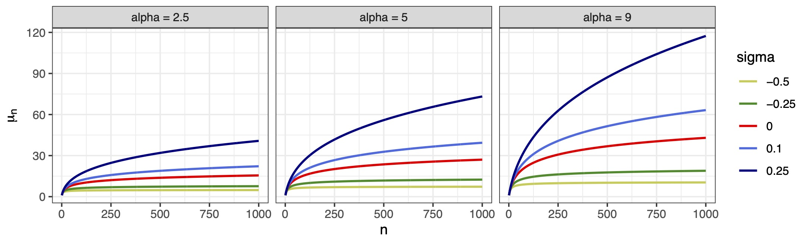{.nostretch fig-align="center" width=60%}


## Regression-based biodiversity indexes


::: callout-warning
#### Theorem (Regression-based diversity)

For the mean function of the a Hubbell regression model with the aforementioned non-canonical link, it holds
$$
\frac{\mu(\bm{x}_i^\top \bm{\beta}; n, \sigma)}{c_n(\sigma)} \longrightarrow S_\sigma(\bm{x}_i^\top\bm{\beta}), \qquad n \to \infty,
$$
Moreover:

  - If $\sigma = 0$, then $c_n(\sigma) = \log n$ ([logarithmic growth]{.blue}) and $S_\sigma(\bm{x}_i^\top\bm{\beta}) = e^{\bm{x}_i^\top\bm{\beta}} = \alpha_i$; 
  - If $\sigma \in (0, 1)$, then $c_n(\sigma) = n^{\sigma}$ ([polynomial growth]{.grey}) and $S_\sigma(\bm{x}_i^\top\bm{\beta}) = e^{\bm{x}_i^\top\bm{\beta}}/\sigma = \alpha_i / \sigma$;  
- if $\sigma < 0$, then $c_n(\sigma) = 1$ ([finite richness]{.orange}) and $S_\sigma(\bm{x}_i^\top\bm{\beta}) \approx C_\sigma^{-1}e^{\bm{x}_i^\top\bm{\beta}/(1-\sigma)} = C_\sigma^{-1} \alpha_i^{1/(1-\sigma)}$, with $C_\sigma$ a known constant.  
:::

- This gives a novel notion of regression-based biodiversity.


## Composite marginal likelihood and standard errors

- The assumption behind GLMs is that observations are [independent]{.orange}. In our case, we might have seen the same species (or BIN) at two different locations!  

- This information is [lost]{.orange} when calculating the number $Y_i^{(n_i)}$. However, we can interpret
$$
L(\boldsymbol{\beta}) \propto 
\prod_{i=1}^N 
\frac{\alpha_i^{y_i}}
     {(\alpha_i)_{n_i}},
$$
as a [composite marginal likelihood]{.blue}. The estimating equation is still unbiased and estimates consistent.

- We propose [spatially heteroskedastic-consistent]{.blue} standard errors [@CONLEY19991] that use the [Jaccard Index]{.orange} (or similar indices) between two samples:$$
\widehat{\mathrm{se}}(\hat{\boldsymbol{\beta}}) =
(\bm{X}^\top \hat{\bm{W}}\bm{X})^{-1}
\textstyle\sum_{ik} 
{\color{#8B0000}{s_{ik}}}\,
{\color{blue}{\hat{\bm{u}}_i\hat{\bm{u}}_k^\top}}\,
(\bm{X}^\top \hat{\bm{W}}\bm{X})^{-1},
\qquad 
{\color{blue}{\hat{\bm{u}}_i}} =
\frac{\partial}{\partial\boldsymbol{\beta}} 
\log \mathcal{L}(\hat{\boldsymbol{\beta}}),
$$
where ${\color{#8B0000}{s_{ik}}} \in [0,1]$ is the [fraction of shared BINs]{.orange} between locations $i$ and $k$.


## Our scientific questions

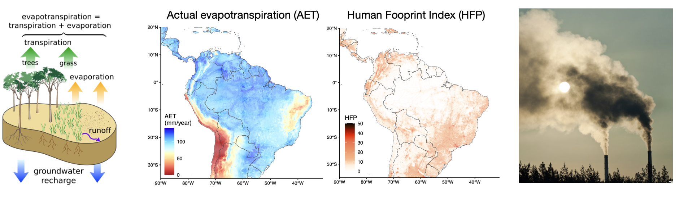{.nostretch fig-align="center" width=100%}


- Is (actual) [evapotranspiration]{.blue} the main driver of diversity? 

- How does [anthropogenic]{.orange} impact affect diversity?


## Modelling approach

- Goal: test the joint effect of [evapotranspiration]{.blue} and [human footprint]{.orange}

```
HubbelGLM(cbind(n, y) ~ ., family = hubbell(sigma = 0), data = data)
```

:::callout-note
#### Model considered (in order of complexity)

- **M0**: no covariates
- **M1**: `AET`
- **M2**: + fixed effect for `realm`
- **M3**: + `time` (julian week, shifter by 6 months if below equator, 1 degree Fourier transform
- **M4**: + spatial gradient (`ns(Latitude, 6)`) 
- **M5**: + `zone` and `hfp` and interaction
- **M6**: + controls (wetlands, wind speed, collection days, residuals of regression of temperature with latitude)
- **M7**: + anomalies for weather (temperature, humidity, precipitation, wind speed)
:::

## Hubbell achieves the best predictive performance 

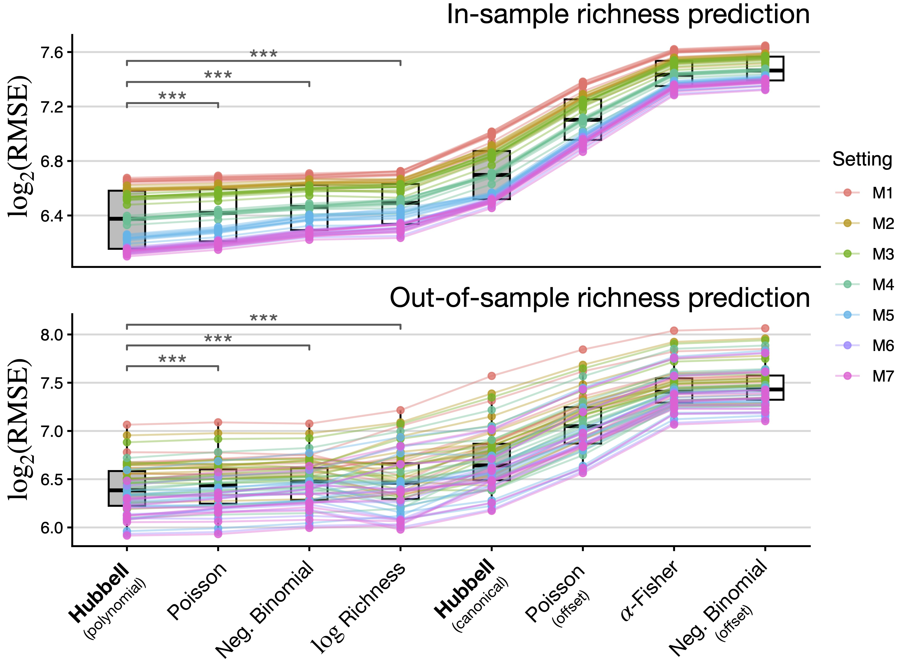{.nostretch fig-align="center" width=50%}


- We run a 10-fold [cross-validation]{.blue} experiment. Our benchmarks are other GLMs (matching the growth rate with $n$).

- For each nested specification, we split the data into 10 folds, train all models in 90% of the data and predict the remaining 10% (cycle through).

## Key results

::: columns

::: {.column width="58%"}

- **Model M0**: $\sigma$ is estimated as $0.562$. [Square root]{.orange}!

- **Model M1**: `AET` explains nearly 30% of the total variation in species richness

- **Model M7**:
  - A 10 mm/year increase in `AET` leads to a $12.4\%$ increase in [diversity]{.blue} on average ($\beta = 0.012$; P $< 0.0001$).
  - A 5 units on the `HFP` scale is associated with a $6.1\%$ reduction in diversity in [tropical areas]{.orange} ($\beta = −0.013$; P $< 0.0001$), and a $7.5\%$ reduction in [dry zones]{.orange} ($\beta = −0.016$; P $< 0.004$)
  - [Polar]{.blue} areas show an interesting increase of $8.2\%$ ($\beta = 0.016$; P $< 0.038$)
  - No detected effect in continental areas
:::

::: {.column width="42%"}
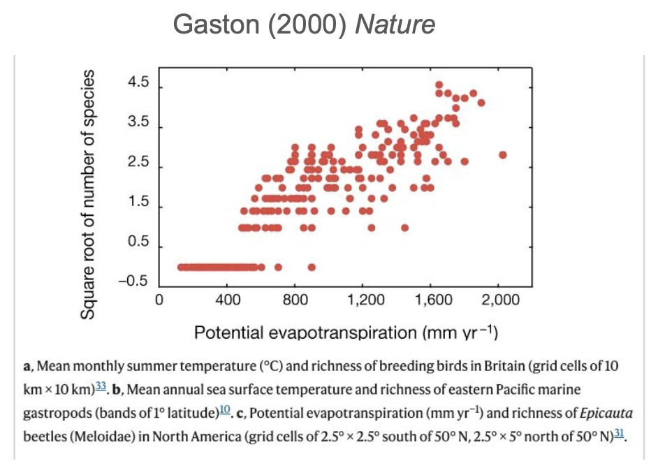{.nostretch fig-align="center" width=100%}
:::

:::

## Effects for all diversity indices: variations

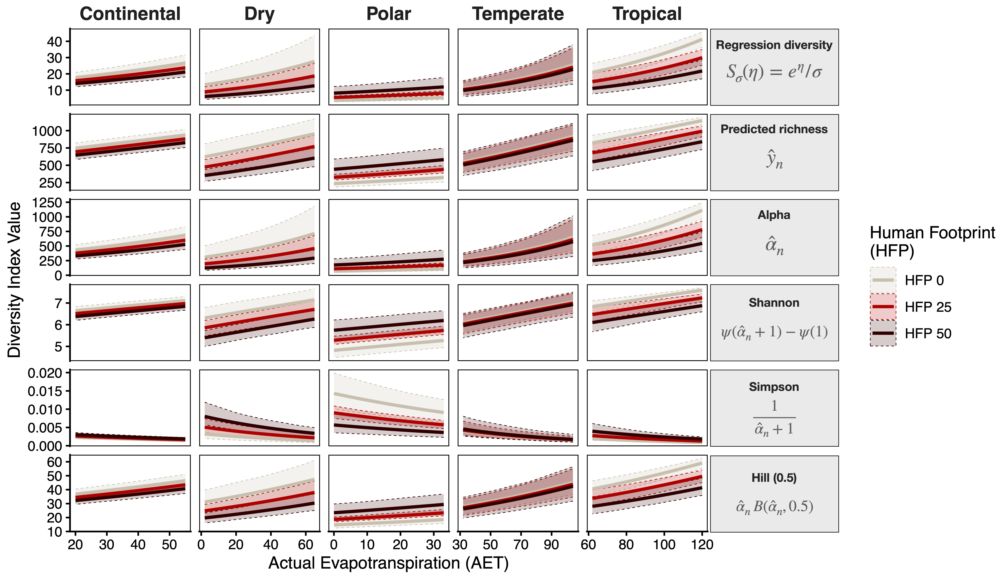{.nostretch fig-align="center" width=90%}


## Effects for all diversity indices: global scales

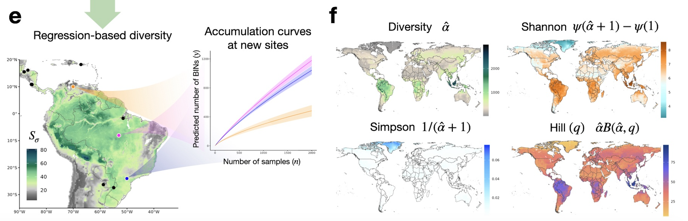{.nostretch fig-align="center" width=100%}


## Scenario evaluation

::: columns

::: {.column width="50%"}

:::callout-note
- Tropical sites with high human activity (`HFP > 30`) miss a median of $197$ species ($21.3\%$ of potential richness).
- Dry sites miss $202$ species ($29.2\%$).
- Temperate sites miss $26$ species ($4.3\%$)
- Continental sites miss $70$ species ($9.23\%$)
::::

- A 5‑unit intensification of human presence globally leads to up to an $8\%$ reduction in potential richness

- A $10\%$ increase in `AET` is associated with an average $3.81\%$ increase in potential richness.

:::

::: {.column width="50%"}
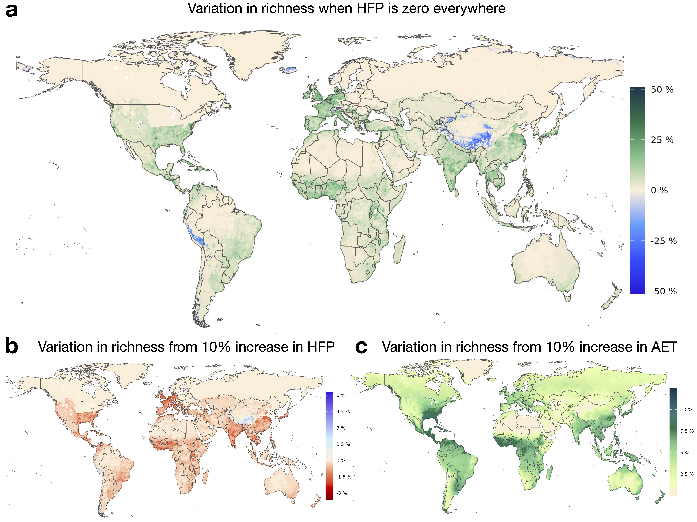{.nostretch fig-align="center" width=100%}
:::

:::


## Summary and future directions

- Fisher's $\alpha$ is the same quantity described by Hubbell's unified neutral theory of biodiversity, and it has deep connections with the Dirichlet process. 

- The Hubbell regression extends the neutral theory in a covariate-dependent [GLM]{.blue} framework.

- Different growth rates are captured via $\sigma < 0$, $\sigma = 0$, and $\sigma \in (0,1)$.

- From here to infinity: next steps
  1. Extend to mixed models, allowing for random effects;
  2. More on nonparametrics: GAMs
  
:::callout-tip

<div style="font-size: 80%;">

Rigon, T., Hsu, C., and Dunson D.B. (2025). A Bayesian theory for estimation of biodiversity. *arXiv:2502.01333*

Zito, A., Rigon, T., Roslin, T., Niittynen, P., Hebert, P. D. N., Zakharov, E., Ratnasingham, S., iBOL Consortium, Ovaskainen, O. and Dunson, D. B. (2026). Predicting global biodiversity via Hubbell regression. *bioRxiv*
</div>

:::


## Software: the R package `HubbellGLM`


::: columns

::: {.column width="55%"}
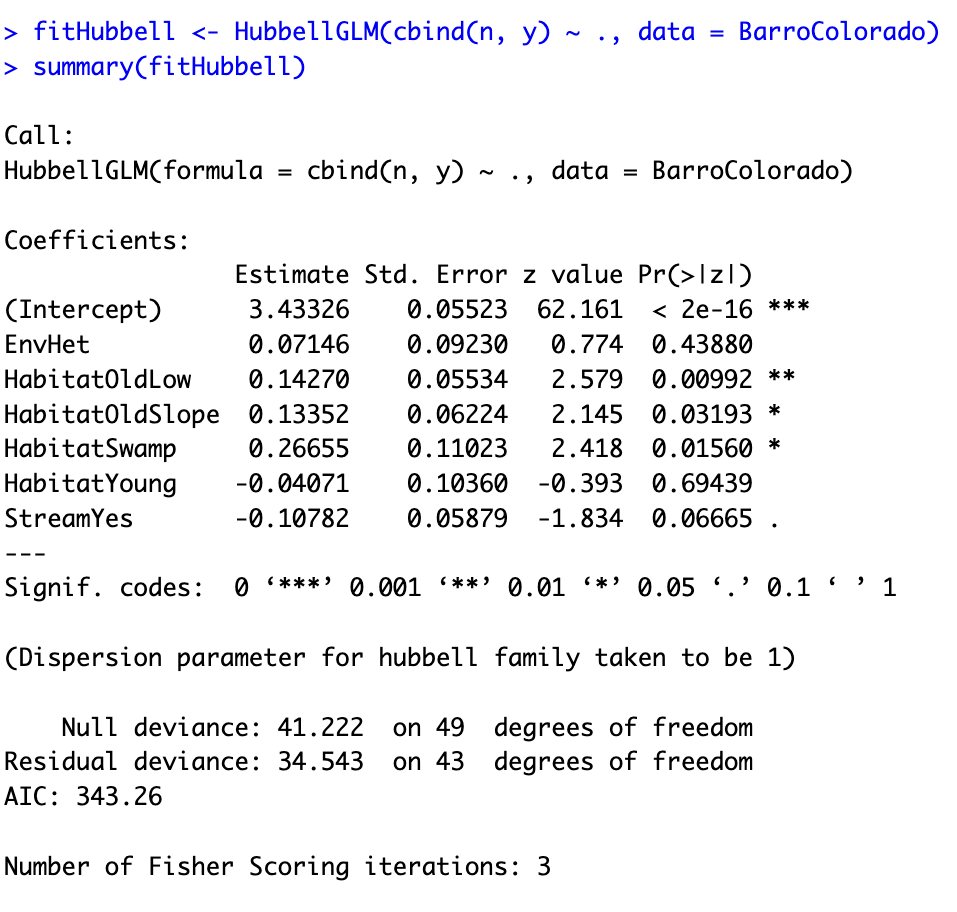{.nostretch fig-align="center" width=100%}
:::

::: {.column width="45%"}
{width="100%"}
:::

:::


## Hubbell regression paper available on *biorXiv*


::: columns

::: {.column width="55%"}
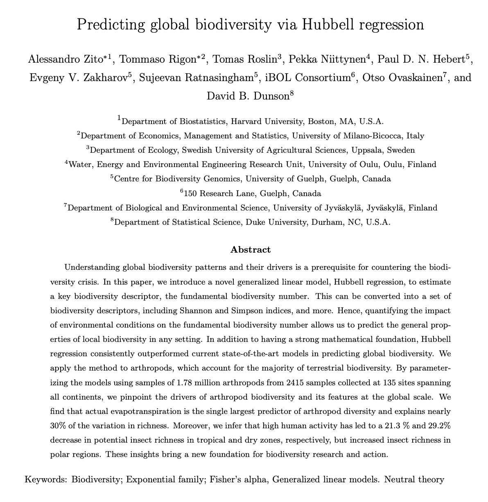{.nostretch fig-align="center" width=100%}
:::

::: {.column width="45%"}
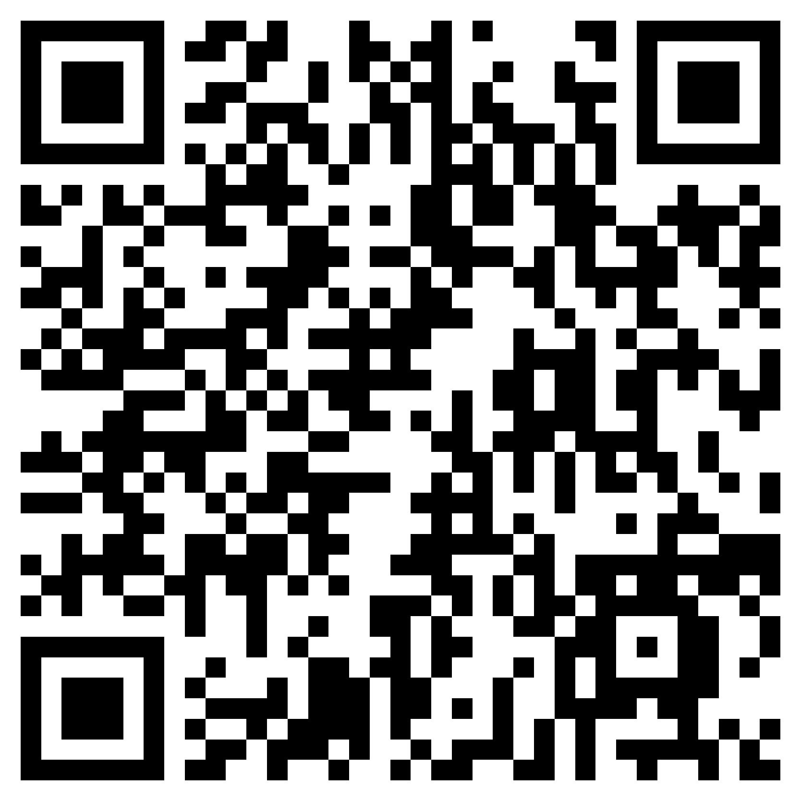{width="100%"}
:::

:::


## References {.unnumbered}

<div style="font-size: 50%;">

::: {#refs}
:::

</div>


